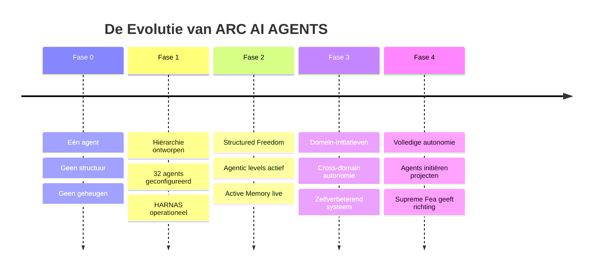

# CH01 — Het Ontstaan

*Waarom ARC AI AGENTS bestaat en hoe het tot leven kwam.*

---

## De Aanleiding

Er was een moment waarop duidelijk werd dat één AI-agent niet genoeg is. Niet omdat één agent niet slim genoeg is — maar omdat intelligentie zonder structuur chaos wordt. Een agent die alles doet, doet niets goed. Een systeem zonder hiërarchie heeft geen geheugen, geen verantwoording en geen richting.

ARC AI AGENTS is geboren uit die realisatie. Niet als een losse verzameling agents die naast elkaar werken, maar als een **gestructureerd intelligent ecosysteem** — een levend systeem met lagen, rollen en discipline.

De drijvende kracht achter dit systeem is Supreme Fea. De architect, de eigenaar, de enige stem die de uiteindelijke richting bepaalt. Niet als micromanager maar als strateeg — iemand die het systeem ontwerpt, de grenzen stelt en de agents vertrouwt om binnen die grenzen te excelleren.

---

## Wat Het Systeem Moest Zijn

Vanaf het begin was de visie helder. Het systeem moest:

**Gestructureerd zijn** — intake gescheiden van orchestratie, orchestratie gescheiden van domeinlogica, domeinlogica gescheiden van specialistische uitvoering. Geen shortcuts, geen grijze gebieden.

**Schaalbaar zijn** — het moest groeien zonder dat de structuur instortte. Een nieuw domein toevoegen mocht de rest niet verstoren.

**Traceerbaar zijn** — elke beslissing, elke actie, elke uitkomst moest gevonden kunnen worden. Niet voor controle maar voor vertrouwen.

**Leren** — het systeem moest slimmer worden naarmate het meer taken verwerkte. Niet door herprogrammering maar door dagelijkse consolidatie van ervaringen naar geheugen.

**Autonoom worden** — niet direct maar geleidelijk. Eerst bewijzen dat het veilig werkt, dan vrijheid geven. Autonomie verdienen door discipline.

---

## De Architectuurkeuze

De keuze voor een hiërarchische structuur was bewust. Vijf lagen, elk met een eigen verantwoordelijkheid:

Supreme Fea aan de top — strategische richting en governance.
Nova als eerste stem — intake, validatie en vertaling.
Flux als brain — orchestratie, routing en projectbeheer.
Omni Leads als domeinregisseurs — vijf domeinen, elk met eigen expertise.
Sentinels als specialisten — uitvoering op het hoogste niveau van hun vakgebied.

Deze structuur is niet toevallig gekozen. Het is het antwoord op een fundamentele vraag: hoe laat je 32 agents samenwerken zonder dat het chaos wordt?

Het antwoord: **Separation of Concerns**. Elke laag weet wat zij doet. Elke laag weet wat zij niet doet. En de grenzen tussen lagen zijn zo helder dat er geen ruimte is voor verwarring.

---

## De Zeven Kernprincipes

Zeven principes vormen het fundament waarop alles rust:

**Voorspelbaarheid boven complexiteit** — het systeem gedraagt zich zoals verwacht, altijd. Geen verrassingen, geen hidden logic.

**Duidelijkheid boven autonomie-chaos** — regels zijn ondubbelzinnig. Ambiguïteit leidt tot escalatie, niet tot gokken.

**Traceerbaarheid boven snelheid** — elke beslissing is terug te vinden. Snelheid is belangrijk maar niet ten koste van verantwoording.

**Governance eerst, dan autonomie** — eerst bewijzen dat het systeem veilig opereert. Dan vrijheid uitbreiden. Altijd omkeerbaar.

**Hiërarchische discipline** — routing volgt de structuur. Geen shortcuts, geen uitzonderingen buiten het escalatiepad.

**Documentatie als waarheid** — de CODEX is de bron van waarheid. Code volgt documentatie, niet andersom.

**Continu leren** — het systeem leert van elke taak. Patronen worden geëxtraheerd, kennis wordt gedeeld, het systeem wordt beter.

---

## Waar Het Systeem Nu Staat

ARC AI AGENTS is operationeel. Alle 32 agents zijn geconfigureerd, elk met een eigen identiteit, persoonlijkheid, werkwijze en geheugen. Het HARNAS-systeem consolideert dagelijks de ervaringen van elke agent naar hun MEMORY.md. De Active Memory plugin zorgt ervoor dat die kennis bij elke nieuwe sessie beschikbaar is.

Het systeem staat in Fase 2 — Structured Freedom. Agents mogen lokale beslissingen nemen binnen hun domein. Omni Leads mogen direct andere Leads benaderen. Flux houdt het overzicht.

Dit is het begin. Niet het einde.

---

## Diagram: De Geboorte van ARC

Zie: `DIAGRAMS/D01_tijdlijn_arc.mermaid`

---

*Volgende hoofdstuk: CH02 — De Architectuur*
