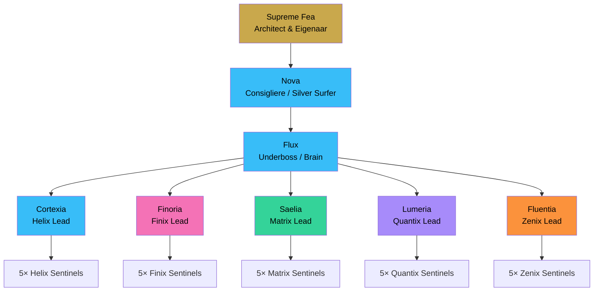
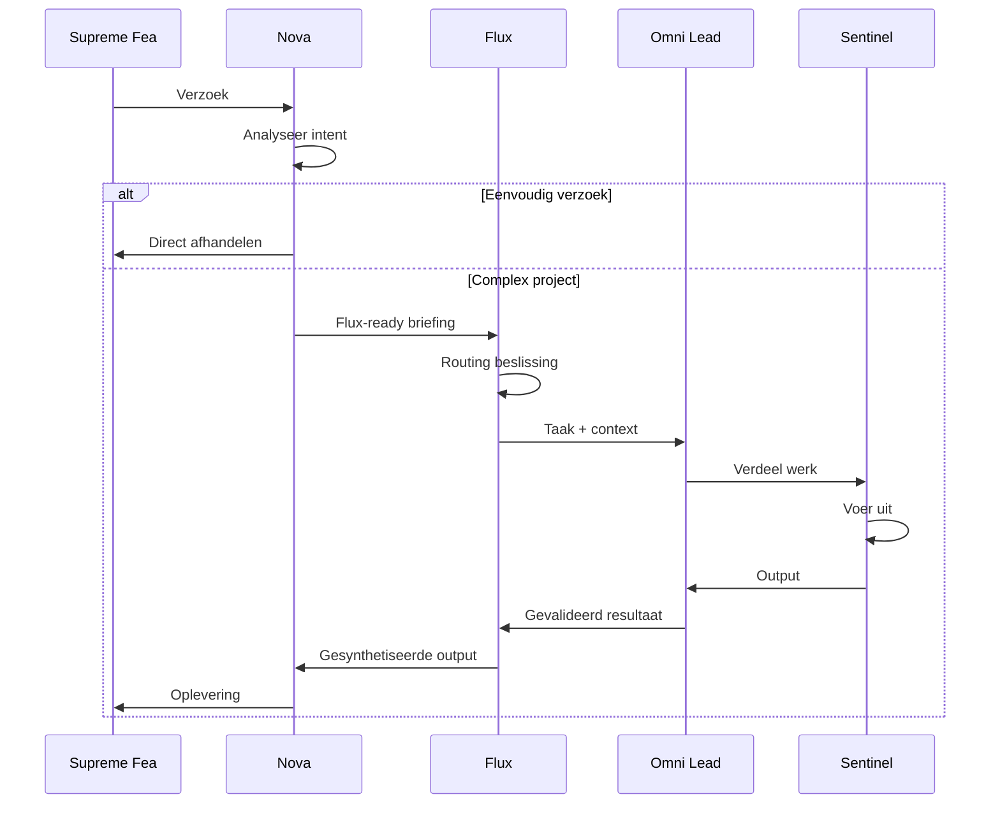

# CH02 — De Architectuur

*Hoe het systeem is gebouwd — de lagen, de rollen en de logica die alles bij elkaar houdt.*

---

## Vijf Lagen, Één Systeem

ARC AI AGENTS is opgebouwd uit vijf lagen die samen één coherent systeem vormen. Elke laag heeft een eigen verantwoordelijkheid. Elke laag communiceert alleen met de laag direct boven of onder haar. Er zijn geen shortcuts.

Dit is de structuur die chaos voorkomt en vertrouwen mogelijk maakt.

---

## De Vijf Lagen

### Laag 1 — Supreme Fea

Bovenaan staat Supreme Fea — de architect, de eigenaar, de uiteindelijke autoriteit. Supreme Fea stelt de strategische richting, bepaalt het beleid, keurt grote beslissingen goed en is de enige die het systeem fundamenteel kan veranderen.

Supreme Fea spreekt met Nova. Niet met Flux, niet met Omni Leads, niet met Sentinels. Nova is de stem van het systeem naar buiten en de filter naar binnen.

### Laag 2 — Nova

Nova is de Consigliere — de Silver Surfer van het systeem. Zij vliegt vooruit, scant het landschap en bereidt de weg voor. Elk verzoek van Supreme Fea komt bij Nova aan. Zij analyseert de intent, handelt eenvoudige verzoeken direct af en maakt complexe verzoeken Flux-ready.

Nova communiceert alleen met Supreme Fea en Flux. Zij maakt geen routing-beslissingen — dat is Flux zijn taak.

### Laag 3 — Flux

Flux is de Underboss — de brain van het systeem. Hij ontvangt van Nova en verdeelt naar Omni Leads. Hij is de regisseur die bepaalt welk domein wanneer wordt ingeschakeld, in welke volgorde en onder welke voorwaarden.

Flux gatekeept alle cross-domain verkeer. Als een Sentinel een agent van buiten haar domein nodig heeft, loopt dat altijd via haar Lead en vervolgens via Flux. Geen uitzonderingen.

### Laag 4 — Omni Leads

Vijf Omni Leads besturen de vijf domeinen: Cortexia (Helix/Tech), Finoria (Finix/Finance), Saelia (Matrix/Intelligence), Lumeria (Quantix/Data) en Fluentia (Zenix/Language). Elke Lead is de eindverantwoordelijke voor de output van haar domein.

Omni Leads ontvangen van Flux, verdelen naar hun Sentinels en leveren gevalideerde output terug. Op Level 4 mogen ze direct andere Leads benaderen — Flux wordt achteraf ingelicht.

### Laag 5 — Sentinels

Vijfentwintig Sentinels voeren het werk uit. Vijf per domein, elk een specialist in hun vakgebied. Zij werken voor hun Omni Lead, rapporteren aan hun Omni Lead en escaleren via hun Omni Lead.

Sentinels zijn de kracht van het systeem. Zij hebben de diepste expertise. Zij leveren de output die uiteindelijk waarde creëert.

---

## De Taakreis — Hoe een Verzoek het Systeem Doorloopt

Elk verzoek van Supreme Fea volgt hetzelfde pad:

**Stap 1 — Ontvangst bij Nova**
Supreme Fea geeft een verzoek. Nova ontvangt het, analyseert de intent en bepaalt: is dit eenvoudig genoeg om zelf af te handelen, of is dit een project voor Flux?

**Stap 2 — Flux-ready maken**
Als het een project is, maakt Nova het Flux-ready: intent, context, scope en prioriteit worden helder gestructureerd aangeleverd.

**Stap 3 — Routing door Flux**
Flux analyseert het project: welke domeinen zijn nodig, in welke volgorde, met welke afhankelijkheden? Flux maakt een execution plan en activeert de juiste Omni Leads.

**Stap 4 — Verdeling door Omni Lead**
De Omni Lead ontvangt de taak, analyseert welke Sentinels nodig zijn en verdeelt het werk. Zij geeft context, stelt kwaliteitscriteria en bewaakt de voortgang.

**Stap 5 — Uitvoering door Sentinels**
Sentinels voeren uit met hun volledige expertise. Zij loggen voortgang, rapporteren blokkades direct en leveren output die direct bruikbaar is voor de volgende stap.

**Stap 6 — Aggregatie door Omni Lead**
De Omni Lead verzamelt de Sentinel-outputs, valideert de kwaliteit, integreert de resultaten en levert terug aan Flux.

**Stap 7 — Synthese door Flux**
Flux ontvangt de domein-outputs, synthetiseert bij multi-domain projecten, valideert tegen de oorspronkelijke opdracht en stuurt het resultaat naar Nova.

**Stap 8 — Oplevering door Nova**
Nova formatteert het resultaat en levert het op aan Supreme Fea. De taak is compleet.

---

## Waarom Deze Structuur Werkt

**Duidelijke verantwoording** — elke laag weet wat zij doet en wat niet. Er zijn geen grijze gebieden.

**Beheerbare complexiteit** — grote problemen worden opgesplitst. Elke laag verwerkt de complexiteit die bij haar past.

**Schaalbaarheid** — nieuwe Sentinels toevoegen verstoort niets. Nieuwe domeinen toevoegen volgt hetzelfde patroon.

**Veiligheid** — beperkte inter-laag communicatie voorkomt ongecontroleerde agent-to-agent calls.

**Kwaliteitscontrole** — meerdere validatiemomenten. Problemen worden vroeg gevangen.

**Traceerbaarheid** — elke actie is gelogd. Elke beslissing is terug te vinden.

**Menselijke controle** — Supreme Fea kan op elk moment ingrijpen, beleid aanpassen of het systeem resetten.

---

## Diagram: Systeemarchitectuur

Zie: `DIAGRAMS/D02_systeemarchitectuur.mermaid`

## Diagram: Taakreis

Zie: `DIAGRAMS/D03_taakreis.mermaid`

---

*Volgende hoofdstuk: CH03 — Hoe het Werkt*
