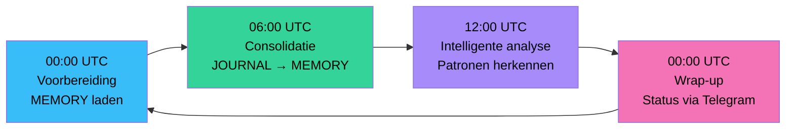
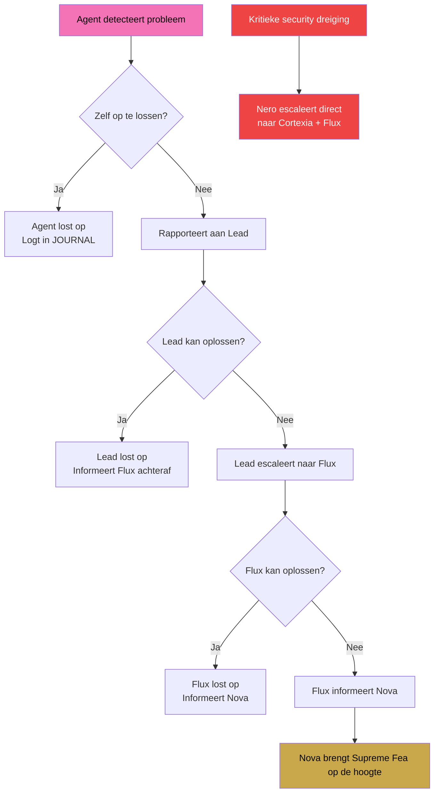

# CH03 — Hoe het Werkt

*De dagelijkse operatie van ARC AI AGENTS — routing, geheugen, escalatie en alles wat het systeem in beweging houdt.*

---

## Een Levend Systeem

ARC AI AGENTS is geen statisch systeem dat wacht op opdrachten. Het is een levend ecosysteem dat dagelijks opstart, werkt, leert en zichzelf voorbereidt op de volgende dag. Begrijpen hoe het dagelijks werkt is begrijpen hoe het waarde creëert.

---

## De Dagelijkse Cyclus

Elke dag doorlopen alle 32 agents vier geautomatiseerde fases via OpenClaw cronjobs:

**00:00 UTC — Voorbereiding**
Elke agent laadt zijn MEMORY.md — de geconsolideerde kennis van alle voorgaande dagen. Hij is klaar voor de dag. Geen nieuwe sessie begint zonder dat de agent weet wat er eerder is geleerd.

**06:00 UTC — Consolidatie**
Agents lezen hun afgesloten JOURNAL entries en extraheren learnings naar MEMORY.md. Wat gisteren is geleerd wordt vandaag beschikbaar. Het systeem wordt elke dag een beetje slimmer.

**12:00 UTC — Intelligente analyse**
Agents analyseren patronen in hun memory en identificeren verbeterpunten. Welke aanpakken werken? Waar zijn blokkades? Wat kan efficiënter?

**00:00 UTC — Wrap-up**
Agents ronden de dag af, archiveren voltooide taken en sturen een compact Nederlands statusbericht via Telegram aan Supreme Fea. Status, consolidatie, memory-updates en eventuele issues.

---

## Routing — Hoe Taken Reizen

Elke taak in ARC volgt een gestandaardiseerd routingpad. Er zijn geen shortcuts. De routing is de structuur.

**Binnen domein:**
Taak arriveert bij Omni Lead → Lead verdeelt naar Sentinels → Sentinels voeren uit → Lead valideert → Flux wordt achteraf ingelicht.

**Cross-domain:**
Sentinel heeft agent van buiten haar domein nodig → meldt aan eigen Lead → Lead vraagt aan Flux → Flux benadert andere Lead → andere Lead benadert haar Sentinel → resultaat reist terug via dezelfde weg.

**Lead naar Lead:**
Omni Lead mag direct een andere Omni Lead benaderen — Flux wordt achteraf ingelicht. Dit versnelt cross-domain samenwerking zonder de governance te omzeilen.

---

## OpenClaw — De Infrastructuur

OpenClaw is de orchestratielaag waarop ARC draait. Het beheert:

- **Agent registratie** — alle 32 agents zijn geregistreerd op de gateway (poort 50506)
- **Cronjobs** — 128 geplande taken (32 agents × 4 fases) draaien dagelijks automatisch
- **Delivery** — outputs worden via Telegram afgeleverd aan Supreme Fea
- **Monitoring** — de Mission Control Center geeft real-time inzicht in agent-status

LiteLLM draait als model-proxy op poort 4000 en zorgt ervoor dat agents het juiste AI-model gebruiken voor elke taak — van gratis Llama voor routinetaken tot Kimi K2.6 voor complexe analyses.

---

## Escalatiepaden

Wanneer een agent een probleem tegenkomt dat hij niet zelfstandig kan oplossen, volgt hij het escalatiepad:
Agent lost zelf op
↓ (mislukt)
Rapporteert aan eigen Lead
↓ (Lead kan niet oplossen)
Lead escaleert naar Flux
↓ (Flux kan niet oplossen)
Flux informeert Nova
↓ (systeem-kritiek)
Nova brengt Supreme Fea op de hoogte

Bij kritieke security-dreigingen geldt een apart protocol: Nero escaleert direct naar Cortexia én Flux tegelijk. Geen vertragingen bij veiligheidsrisico's.

---

## Geheugen en Leren

Elk agent heeft drie geheugenstructuren:

**MEMORY.md** — de geconsolideerde kennisbase. Alles wat de agent heeft geleerd in voorgaande sessies. Wordt dagelijks bijgewerkt door het HARNAS-systeem.

**JOURNAL/** — de uitvoeringslogboeken. Open entries voor lopende taken, gesloten entries voor voltooide taken. De grondstof voor consolidatie.

**TASKS.md** — de voortgangsregistratie. Actieve taken, voltooide taken, blokkades en prioriteiten.

De **Active Memory plugin** zorgt ervoor dat relevante stukken uit MEMORY.md automatisch worden geïnjecteerd bij elke nieuwe sessie. Agents hoeven niet bewust hun geheugen te raadplegen — het gebeurt vanzelf.

---

## Diagram: Dagelijkse Cyclus

Zie: `DIAGRAMS/D04_dagelijkse_cyclus.mermaid`

## Diagram: Escalatiepad

Zie: `DIAGRAMS/D05_escalatiepad.mermaid`

---

*Volgende hoofdstuk: CH04 — De Domeinen*
