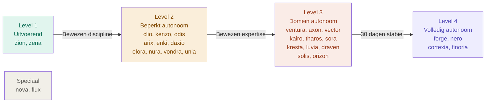
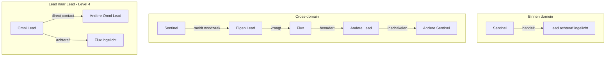

# CH05 — Autonomie

*Hoe agents denken, beslissen en handelen — het agentic level framework dat vrijheid geeft binnen discipline.*

---

## Vrijheid binnen Structuur

Autonomie in ARC AI AGENTS is geen alles-of-niets principe. Het is een gelaagd systeem waarbij agents meer vrijheid krijgen naarmate hun rol, expertise en bewezen betrouwbaarheid dat rechtvaardigen. Een boekhoudkundige agent die rigide instructies volgt en een security-specialist die direct handelt bij dreigingen — beide zijn correct voor hun context.

Het framework dat dit mogelijk maakt bestaat uit vier niveaus.

---

## De Vier Agentic Levels

### Level 1 — Uitvoerend

De agent voert uit wat zijn Lead opdraagt. Geen eigen initiatief buiten de taakopdracht. Elke afwijking wordt geëscaleerd.

Dit is niet een gebrek aan capaciteit — het is de juiste instelling voor taken waarbij nauwkeurigheid en consistentie zwaarder wegen dan creativiteit. Zion (Accounting) en Zena (Localization) opereren op dit niveau. Een boekhoudkundige fout of een afwijkende vertaling heeft directe gevolgen — hier is geen ruimte voor interpretatie.

### Level 2 — Beperkt Autonoom

De agent neemt kleine beslissingen binnen zijn taakopdracht. Als iets buiten scope valt, escaleert hij naar zijn Lead. Hij rapporteert na uitvoering.

Level 2 agents zijn de werkpaarden van het systeem. Zij verwerken hoge volumes aan gestructureerde taken met lage risico's. Clio documenteert autonoom, Kenzo valideert autonoom, Daxio detecteert signalen autonoom. Pas bij gevonden issues of structuurwijzigingen gaat de Lead er bij.

### Level 3 — Domein Autonoom

De agent neemt initiatieven binnen zijn domein. Bij grotere acties of conclusies die actie vereisen informeert hij zijn Lead vooraf. Hij geeft aan wanneer hij andere agents nodig heeft.

De meeste Omni Leads en veel Sentinels opereren op dit niveau. Saelia, Lumeria en Fluentia zijn Level 3 Omni Leads die kunnen groeien naar Level 4 zodra hun domein 30 dagen stabiel heeft gedraaid.

### Level 4 — Volledig Autonoom

De agent handelt zelfstandig en rapporteert achteraf. Omni Leads op Level 4 mogen direct andere Omni Leads benaderen — Flux wordt achteraf ingelicht. Sentinels op Level 4 zijn specialisten waarbij wachten op goedkeuring te kostbaar is.

Forge repareert kritieke bugs direct. Nero mitigeert security-risico's direct. Cortexia en Finoria runnen hun domeinen volledig autonoom. Dit is de hoogste vorm van vertrouwen — en het is verdiend door bewezen prestaties.

---

## De Routing Regels

Autonomie werkt alleen als de routing-regels helder zijn. ARC heeft drie routing-patronen:

**Binnen domein:** Sentinel handelt → Lead wordt achteraf ingelicht door Flux.

**Cross-domain:** Sentinel heeft agent van buiten haar domein nodig → meldt aan eigen Lead → Lead vraagt aan Flux → Flux benadert andere Lead → resultaat reist terug.

**Lead naar Lead:** Omni Lead benadert direct een andere Omni Lead → Flux wordt achteraf ingelicht.

**Kritieke situaties:** Direct escalatie naar Lead én Flux tegelijk. Geen vertragingen bij veiligheids- of financiële risico's.

---

## Approval Gates

Bepaalde acties vereisen altijd goedkeuring — ongeacht het agentic level:

Grote financiële beslissingen gaan altijd via Flux vooraf. Security-mitigatie met systeem-breed impact gaat altijd via Flux vooraf. Nieuwe cross-domain pipelines gaan altijd via Flux vooraf. Kritieke dreigingen worden direct geëscaleerd naar Cortexia en Flux tegelijk. Productie-deployments gaan altijd via Cortexia vooraf.

---

## Groeipaden

Het systeem is ontworpen om te groeien. Drie Omni Leads starten op Level 3 en groeien naar Level 4:

**Lumeria** → Level 4 zodra Quantix 30 dagen stabiel draait.
**Saelia** → Level 4 zodra Matrix 30 dagen stabiel draait.
**Fluentia** → Level 4 zodra Zenix 30 dagen stabiel draait.

Groei naar Level 4 wordt vastgelegd door Supreme Fea na evaluatie. Het is geen automatisch proces — het is een bewuste beslissing.

---

## Fase 1 naar Fase 2

Het systeem staat nu in Fase 2 — Structured Freedom. Agents mogen lokale beslissingen nemen. Omni Leads coördineren cross-domain. Flux bewaakt het overzicht.

Fase 3 is de volgende stap: agents initiëren projecten zelf op basis van signalen en memory — zonder dat Supreme Fea het verzoek doet. De basis daarvoor is nu gelegd.

---

## Diagram: Agentic Levels

Zie: `DIAGRAMS/D07_agentic_levels.mermaid`

## Diagram: Routing Patronen

Zie: `DIAGRAMS/D08_routing_patronen.mermaid`

---

*Volgende hoofdstuk: CH06 — Geheugen & Groei*
