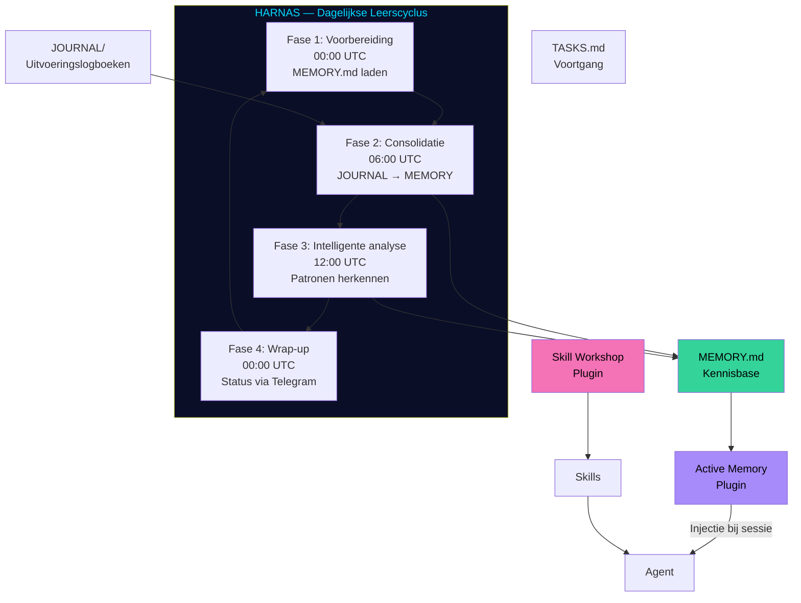
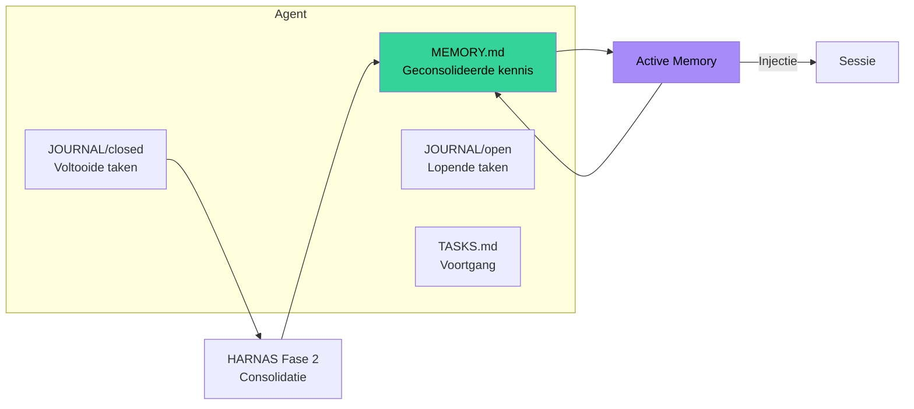

# CH06 — Geheugen & Groei

*Hoe ARC AI AGENTS leert, onthoudt en zichzelf elke dag verbetert — het HARNAS-systeem en de geheugenstructuur die agents slimmer maken.*

---

## Een Systeem dat Leert

Het verschil tussen een agent die taken uitvoert en een agent die écht intelligent is, zit in geheugen. Een agent zonder geheugen begint elke sessie opnieuw. Een agent met geheugen bouwt expertise op, herkent patronen en wordt beter naarmate hij meer ervaringen consolideert.

ARC AI AGENTS is gebouwd om te leren. Niet door herprogrammering maar door dagelijkse consolidatie van ervaringen naar gestructureerd geheugen. Het HARNAS-systeem maakt dit mogelijk.

---

## HARNAS — Het Autonome Leerssysteem

HARNAS staat voor Handling Resources Non-Assiduously — het systeem dat agents in staat stelt hun eigen bestanden te beheren, ervaringen te consolideren en zichzelf te verbeteren zonder menselijke tussenkomst.

HARNAS draait via OpenClaw cronjobs en doorloopt dagelijks vier fases voor alle 32 agents:

**Fase 1 — Voorbereiding (00:00 UTC)**
Elke agent laadt zijn MEMORY.md. Hij weet wat hij gisteren heeft geleerd en is klaar voor de dag. Dit is de basis waarop elke sessie begint.

**Fase 2 — Consolidatie (06:00 UTC)**
De agent leest zijn afgesloten JOURNAL entries en extraheert learnings. Wat gisteren is uitgevoerd wordt vandaag beschikbaar als geconsolideerde kennis. MEMORY.md groeit dagelijks.

**Fase 3 — Intelligente analyse (12:00 UTC)**
De agent analyseert patronen in zijn memory. Welke aanpakken werken? Waar zijn blokkades? Wat kan efficiënter? De agent identificeert verbeterpunten en legt ze vast.

**Fase 4 — Wrap-up (00:00 UTC)**
De agent rondt de dag af, archiveert voltooide taken en stuurt een compact Nederlands statusbericht via Telegram aan Supreme Fea. Status, consolidatie, memory-updates en eventuele issues — alles in één overzichtelijk bericht.

128 cronjobs draaien dagelijks automatisch — 32 agents maal 4 fases. Het systeem werkt ook als niemand kijkt.

---

## De Geheugenstructuur

Elke agent heeft drie geheugenstructuren die samen zijn kennis vormen:

**MEMORY.md — De kennisbase**
De geconsolideerde kennis van alle voorgaande sessies. Alles wat de agent heeft geleerd — patronen, succesvolle aanpakken, valkuilen, domein-inzichten. Wordt dagelijks bijgewerkt door HARNAS.

**JOURNAL/ — De uitvoeringslogboeken**
Open entries voor lopende taken, gesloten entries voor voltooide taken. De grondstof voor consolidatie. Elk beslissing, elke actie, elke uitkomst wordt gelogd in JOURNAL. Na voltooiing wordt een entry gesloten en verwerkt door HARNAS.

**TASKS.md — De voortgangsregistratie**
Actieve taken, voltooide taken, blokkades en prioriteiten. De dagelijkse werklijst van de agent.

---

## Active Memory — Automatische Injectie

De Active Memory plugin zorgt ervoor dat relevante stukken uit MEMORY.md automatisch worden geïnjecteerd bij elke nieuwe sessie. Agents hoeven niet bewust hun geheugen te raadplegen — het gebeurt vanzelf.

Dit is de brug tussen HARNAS en de dagelijkse werking. HARNAS schrijft naar MEMORY.md. Active Memory leest uit MEMORY.md en injecteert het in de context. De agent werkt altijd met zijn meest recente kennis.

---

## Skill Workshop — Herhaalbare Workflows

De Skill Workshop plugin stelt agents in staat herhaalbare workflows vast te leggen als skills. Als Forge een effectief patroon heeft ontdekt voor het debuggen van een specifiek type fout, kan hij dat als skill opslaan. De volgende keer dat een vergelijkbare situatie zich voordoet, heeft hij de aanpak direct beschikbaar.

Skills zijn domein-specifiek en worden beheerd door de Omni Lead. Cortexia bewaakt de Helix skill-bibliotheek. Finoria die van Finix. Enzovoort.

---

## Kosten en Efficiëntie

HARNAS is bewust kostenefficiënt ontworpen. Fases 1-3 zijn puur bestandsoperaties — geen LLM-kosten. Alleen Fase 4 (wrap-up) gebruikt een LLM om het statusbericht te schrijven.

De wrap-up draait op Gemini 2.5 Flash — de goedkoopste betrouwbare optie. Totale kosten voor alle 32 agents: circa €21 per jaar. Dat is de prijs van een systeem dat dagelijks leert en rapporteert.

---

## Diagram: HARNAS Cyclus

Zie: `DIAGRAMS/D09_harnas_cyclus.mermaid`

## Diagram: Geheugenstructuur per Agent

Zie: `DIAGRAMS/D10_geheugenstructuur.mermaid`

---

*Volgende hoofdstuk: CH07 — Governance*
