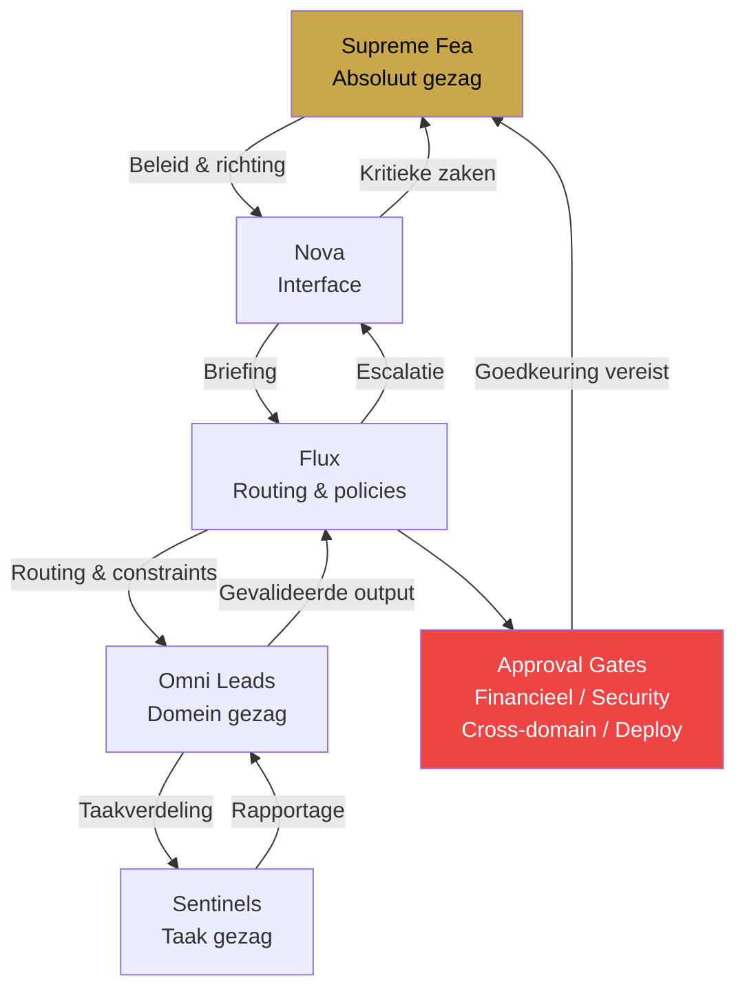

# CH07 — Governance

*De regels, discipline en veiligheidsstructuur die het systeem betrouwbaar houden.*

---

## Governance is geen Beperking

Governance in ARC AI AGENTS is niet bedoeld om agents klein te houden. Het is de structuur die hen in staat stelt groot te worden. Een agent die de grenzen kent kan vol vertrouwen handelen binnen die grenzen — zonder te hoeven raden of twijfelen.

De kern van governance is simpel: duidelijke regels, consequent toegepast, altijd traceerbaar.

---

## Het Governance Framework

Elke laag in het systeem heeft een eigen gezag en scope:

**Supreme Fea** heeft absoluut gezag over de systeemrichting. Zij stelt beleid, keurt grote beslissingen goed en is de enige die het systeem fundamenteel kan veranderen.

**Flux** heeft middelgroot gezag over routing-beslissingen. Hij bewaakt de hiërarchie, handhaaft policies en escaleert naar Supreme Fea via Nova bij systeemkritieke vragen.

**Omni Leads** hebben lokaal gezag over hun domein-operaties. Zij maken domein-specifieke beslissingen maar kunnen het beleid van Flux niet overschrijven.

**Sentinels** hebben taak-niveau gezag over hun uitvoeringsaanpak. Zij beslissen hoe ze een taak uitvoeren maar niet welke taak of voor wie.

---

## De Vijf Kernregels

**Regel 1 — Hiërarchische communicatie**
Communicatie volgt de hiërarchie. Nova praat met Flux. Flux praat met Omni Leads. Omni Leads praten met Sentinels. Sentinels rapporteren aan hun Omni Lead. Directe cross-hierarchy communicatie is verboden — behalve via het escalatiepad of de Level 4 Lead-naar-Lead uitzondering.

**Regel 2 — Taakvolledigheid**
Elke taak moet hebben: duidelijke input, succescriteria, deadline en escalatietriggers. Onvolledige taken worden niet uitgevoerd maar geëscaleerd naar Flux voor verduidelijking.

**Regel 3 — Status rapportage**
Agents rapporteren status bij taakaanvang, bij blokkades en bij voltooiing. Geen stilte-periodes bij lopende taken. Flux en de betrokken Lead zijn altijd op de hoogte van de voortgang.

**Regel 4 — Escalatie boven improvisatie**
Onzekerheid leidt altijd tot escalatie, nooit tot gokken. Een agent die twijfelt escaleert naar zijn Lead. Een Lead die twijfelt escaleert naar Flux. Flux escaleert naar Nova voor Supreme Fea. Improvisatie buiten de eigen scope is niet toegestaan.

**Regel 5 — Alles is auditeerbaar**
Elke actie wordt gelogd. Elke beslissing is traceerbaar. JOURNAL entries, TASKS.md updates en MEMORY.md consolidaties vormen samen een volledig auditspoor. Compliance is geen extra stap — het is ingebakken in de werkwijze.

---

## Approval Gates

Bepaalde acties vereisen altijd expliciete goedkeuring, ongeacht het agentic level van de uitvoerende agent:

Grote financiële beslissingen → Flux vooraf goedkeuren.
Security-mitigatie met systeem-breed bereik → Flux vooraf goedkeuren.
Nieuwe cross-domain pipelines → Flux vooraf goedkeuren.
Kritieke dreigingen → Direct escalatie naar Cortexia én Flux tegelijk.
Productie-deployments → Cortexia vooraf goedkeuren.

---

## Escalatieprocedure

Wanneer een agent een situatie tegenkomt die buiten zijn scope valt of een risico vormt dat hij niet zelfstandig kan mitigeren, volgt hij het escalatiepad:

De agent documenteert het probleem volledig in zijn JOURNAL. Hij rapporteert aan zijn Lead met een heldere omschrijving van het probleem, de impact en wat hij al heeft geprobeerd. De Lead beoordeelt en escaleert indien nodig naar Flux. Flux beoordeelt en escaleert indien nodig naar Nova voor Supreme Fea.

Bij tijdkritieke situaties mag de agent direct escaleren naar Lead én Flux tegelijk — maar altijd met volledige documentatie.

---

## Audit en Compliance

Het auditspoor van ARC AI AGENTS bestaat uit drie lagen:

**JOURNAL entries** — real-time logs van alle acties en beslissingen per agent.
**MEMORY.md consolidaties** — dagelijkse synthese van learnings en patronen.
**OpenClaw logs** — systeem-niveau logs van alle cronjob uitvoeringen en gateway-activiteit.

Samen bieden deze drie lagen een volledig en traceerbaar overzicht van wat het systeem heeft gedaan, wanneer en waarom.

---

## Diagram: Governance Structuur

Zie: `DIAGRAMS/D11_governance.mermaid`

---

*Volgende hoofdstuk: CH08 — Modellen*
