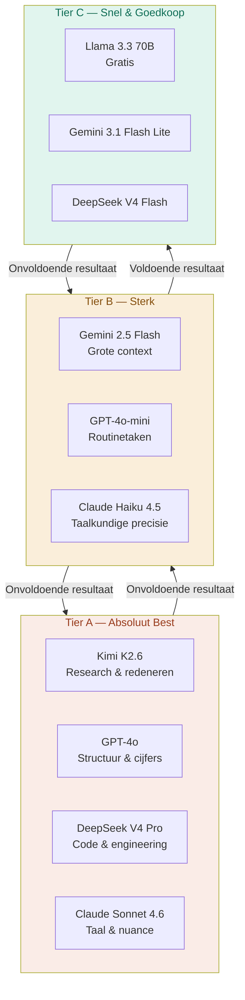

# CH08 — Modellen

*Welk AI-brein elke agent gebruikt — het drie-tier model routing systeem dat kwaliteit en kosten in balans houdt.*

---

## Het Juiste Brein voor de Juiste Taak

Niet elke taak vereist het krachtigste beschikbare model. Een documentatietaak heeft geen Claude Sonnet nodig. Een kritieke security-analyse verdient geen gratis Llama-model. Het model routing systeem van ARC AI AGENTS zorgt ervoor dat elke agent het model gebruikt dat past bij de complexiteit en het risico van zijn taken.

Dit principe — het juiste brein voor de juiste taak — bespaart kosten zonder kwaliteit in te leveren.

---

## De Drie Tiers

### Tier A — Absoluut Best

Tier A is gereserveerd voor taken waarbij kwaliteit boven alles gaat. Als een Tier A model de taak niet aankan, kan geen enkel ander model dat ook.

Tier A wordt ingezet bij kritieke beslissingen met directe impact, complexe redenering waarbij nuance essentieel is, taken waarbij een fout cascadeert door het systeem en nieuwe of onduidelijke vraagstukken zonder precedent.

De modellen in Tier A zijn (goedkoopste eerst): Kimi K2.6 voor research en redenering, GPT-4o voor structuur en cijfers, DeepSeek V4 Pro voor code en engineering, en Claude Sonnet 4.6 voor taalkundige diepgang.

### Tier B — Sterk, 90% van de Taken

Tier B is de werkhorslaag van ARC. De meeste dagelijkse taken worden hier afgehandeld. Tier B biedt uitstekende kwaliteit tegen een fractie van de Tier A kosten.

De modellen in Tier B zijn (goedkoopste eerst): Gemini 2.5 Flash voor grote contexten en snelheid, GPT-4o-mini voor structuur en routinetaken, en Claude Haiku 4.5 voor taalkundige nauwkeurigheid.

### Tier C — Snel en Goedkoop

Tier C is voor routinetaken met lage complexiteit en hoog volume. Fouten hier zijn herstelbaar en hebben weinig impact.

Llama 3.3 70B is de standaard Tier C keuze — volledig gratis via OpenRouter. Gemini 3.1 Flash Lite en DeepSeek V4 Flash zijn betaalde alternatieven als Llama rate-limited is.

---

## Complexiteitsweging

Elke agent weegt een taak op vier criteria voordat hij een tier kiest:

**Scope** — enkelvoudige actie (1), meerdere stappen (2), of systeem-breed impact (3).
**Risico** — informatief en herstelbaar (1), beperkt risico (2), of kritiek en onomkeerbaar (3).
**Context** — geen history nodig (1), gedeeltelijke context (2), of volledige context vereist (3).
**Complexiteit** — template en herhaalbaar (1), redenering vereist (2), of strategisch en nieuw (3).

Score 4-6 → Tier C. Score 7-9 → Tier B. Score 10-12 → Tier A.

---

## Model per Domein

Elk domein heeft een eigen model-profiel dat past bij de aard van het werk:

**Helix/Tech** — maximale flexibiliteit. DeepSeek V4 Pro als Tier A baseline voor code-taken. Agents kiezen zelf op basis van de taak. Nero gebruikt nooit DeepSeek vanwege Chinese infrastructuur.

**Finix/Finance** — GPT-4o als Tier A, Gemini 2.5 Flash als Tier B, Llama als Tier C. Consistent door het hele domein.

**Matrix/Intelligence** — Kimi K2.6 als Tier A, Gemini 2.5 Flash als Tier B, Llama als Tier C.

**Quantix/Data** — zelfde patroon als Matrix.

**Zenix/Language** — Kimi K2.6 als Tier A, GPT-4o-mini of Gemini 2.5 Flash als Tier B afhankelijk van de agent, Llama als Tier C.

---

## Escalatie en De-escalatie

Agents beginnen altijd op hun baseline tier. Als het resultaat onvoldoende is: escaleer naar de volgende tier. Als dezelfde taaksoort vijf keer succesvol was op een lagere tier: overweeg de-escalatie.

Dit is het systeem dat zichzelf optimaliseert — niet door herprogrammering maar door het gedrag van de agents zelf.

---

## Diagram: Model Tier Systeem

Zie: `DIAGRAMS/D12_model_tiers.mermaid`

---

*Volgende hoofdstuk: CH09 — Skills*
