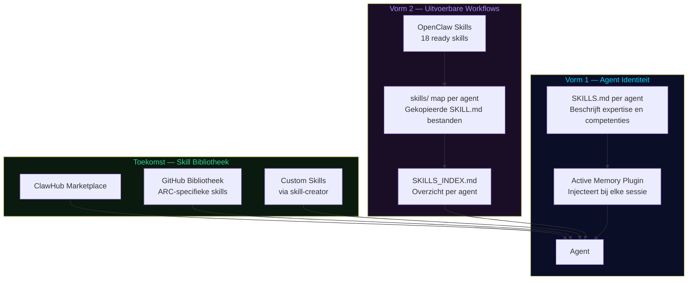

# CH09 — Skills

*Wat agents kunnen en hoe ze het doen — de twee vormen van skills die samen agent intelligentie mogelijk maken.*

---

## Twee Vormen van Skills

In ARC AI AGENTS bestaat het begrip "skill" in twee fundamenteel verschillende maar complementaire vormen. Het begrijpen van dit onderscheid is essentieel om te begrijpen hoe agents intelligent en effectief werken.

---

## Vorm 1 — SKILLS.md: Agent Identiteit

De eerste vorm is de SKILLS.md per agent — een beschrijvend document dat vastlegt wat een agent kan, hoe hij denkt en waar zijn expertise ligt. Dit is geen uitvoerbare code maar een identiteitsdocument.

Via de Active Memory plugin wordt de SKILLS.md bij elke sessie automatisch geïnjecteerd in de context van de agent. Het resultaat: de agent kent zijn eigen expertise en werkt vanuit zijn sterktes.

**Wat staat er in een SKILLS.md:**
Concrete competenties per specialisatie, beschreven in het Nederlands en passend bij de rol van de agent. Forge's SKILLS.md beschrijft backend development, debugging en refactoring. Arix's SKILLS.md beschrijft bronidentificatie, validatie en onderzoekssynthese. Elke SKILLS.md is uniek en specifiek.

**Hoe we tot deze keuze zijn gekomen:**
Bij het opbouwen van ARC AI AGENTS merkten we dat agents zonder expliciete zelfkennis generiek gedrag vertoonden. Door elke agent een gedetailleerde SKILLS.md te geven die via Active Memory wordt geïnjecteerd, werken agents vanuit hun eigen expertise — niet als een generieke LLM maar als een specialist.

---

## Vorm 2 — OpenClaw Skills: Uitvoerbare Workflows

De tweede vorm zijn de OpenClaw Skills — uitvoerbare SKILL.md bestanden die agents vertellen *hoe* ze specifieke taken uitvoeren. Dit zijn concrete workflows die direct aanroepbaar zijn.

OpenClaw heeft 61 beschikbare skills waarvan 18 direct ready zijn. De ready-skills zijn geconfigureerd en per agent geïnstalleerd in de `skills/` map van elke agent.

**Hoe OpenClaw Skills werken:**
Een SKILL.md bevat instructies, regels en context voor een specifieke taak. Als Forge de `node-inspect-debugger` skill heeft, weet hij precies hoe hij een Node.js debugging sessie opzet. Als Arix de `tavily` skill heeft, weet hij hoe hij gestructureerde research uitvoert met bronvermelding.

**De 18 geïnstalleerde skills:**

*System:* `healthcheck` — systeem gezondheidscheck voor alle agents

*Knowledge:* `wiki-maintainer` — wiki kennisbase beheren, `obsidian-vault-maintainer` — kennisstructuur onderhouden

*Workflow:* `taskflow` — taakbeheer workflows, `taskflow-inbox-triage` — inbox prioritering

*Search:* `tavily` — gestructureerde web research

*Web:* `browser-automation` — multi-step web flows

*Engineering:* `node-inspect-debugger`, `python-debugpy`, `tmux` — debugging en terminal beheer

*Visual:* `diagram-maker` — diagrammen en flows, `canvas` — HTML visualisaties

*Voice:* `openai-whisper-api` — speech-to-text

*Meta:* `skill-creator` — nieuwe skills aanmaken

*Research:* `spike` — experimentele taken

---

## Skills per Agent Type

**Core agents (Nova, Flux):**
Healthcheck, taskflow, taskflow-inbox-triage, wiki-maintainer. Flux heeft ook skill-creator — hij kan nieuwe skills aanmaken voor het systeem.

**Engineering agents (Forge, Cortexia):**
Bovenop de basis: node-inspect-debugger, python-debugpy, tmux, browser-automation. De volledige engineering toolset.

**Research agents (Arix, Elora, Tharos, Draven):**
Tavily en browser-automation. Research vereist zoeken en scrapen.

**Kennisbeheer agents (Enki, Nura):**
Wiki-maintainer en obsidian-vault-maintainer. Kennisstructuur is hun core business.

**Orchestratie agents (Omni Leads):**
Taskflow en taskflow-inbox-triage. Leads managen taken en prioriteiten.

**Visualisatie agents (Clio, Sora, Lumeria, Kresta):**
Diagram-maker. Kennis en data visueel maken.

---

## De Skill Bibliotheek — Toekomst

De huidige skills komen uit de OpenClaw bundled en extra collecties. De volgende stap is een eigen skill bibliotheek bouwen:

**ClawHub** — de OpenClaw skill marketplace. Skills zoeken, installeren en publiceren via `openclaw skills search` en `openclaw skills install`.

**GitHub Bibliotheek** — een eigen repository met ARC-specifieke skills. FORGE beheert deze bibliotheek en kan via een geautomatiseerde pipeline nieuwe skills ophalen en aan agents toewijzen.

**Custom Skills** — via de `skill-creator` skill kunnen Flux en Fluentia nieuwe skills aanmaken die specifiek zijn voor ARC's workflows. Research pipeline, content pipeline, trading workflow — dit worden straks skills die agents direct kunnen aanroepen.

---

## Skills in de Mission Control Center

De Skills tab in de Kernel sectie van de MCC geeft inzicht in beide vormen:

**Overzicht** — alle 15 geconfigureerde OpenClaw skills met categorie, bron en hoeveel agents ze gebruiken. Met categorie-filter en klikbare kaarten die de agent-lijst tonen.

**Domeinen** — per domein welke skills beschikbaar zijn.

**Agents** — per agent de volledige lijst van geconfigureerde skills.

De uitleg van de twee skill-vormen staat direct zichtbaar in het overzicht — zodat iedereen die de MCC opent begrijpt wat het verschil is.

---

## Diagram: Skill Ecosysteem

Zie: `DIAGRAMS/D13_skill_ontwikkeling.mermaid`

---

*Volgende hoofdstuk: CH10 — Tools*
