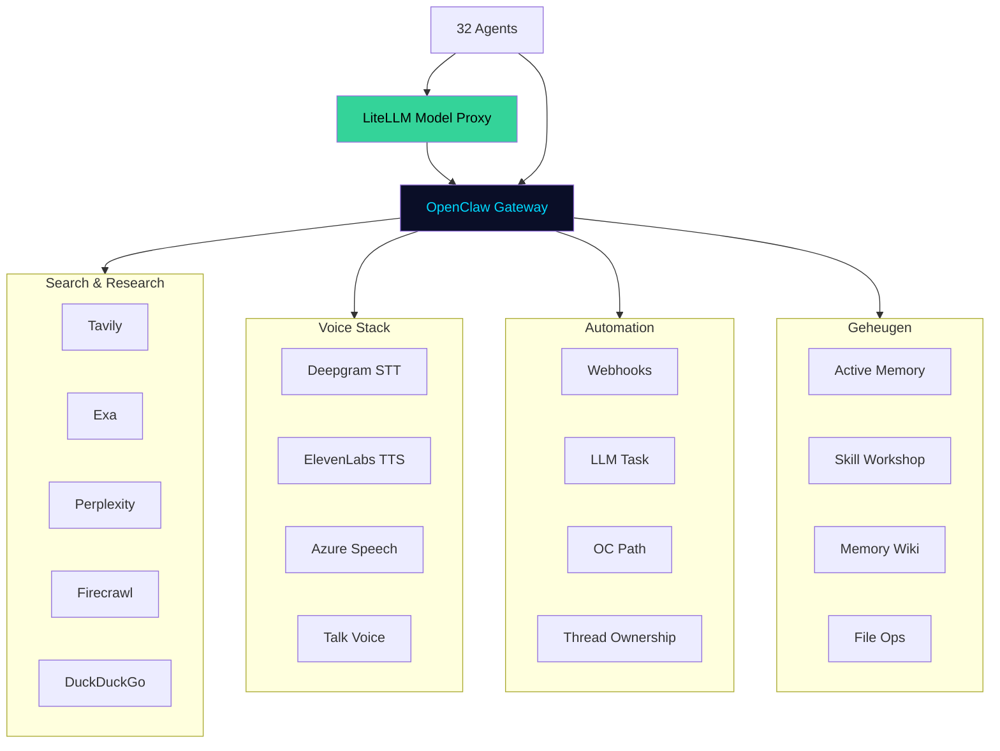

# CH10 — Tools

*Wat agents gebruiken — de instrumenten, systemen en integraties die agents in staat stellen hun werk te doen.*

---

## Tools als Verlengstuk van Expertise

Een agent zonder tools is een expert zonder gereedschap. Kennis alleen is niet genoeg — het vermogen om die kennis om te zetten in actie vereist de juiste instrumenten. In ARC AI AGENTS zijn tools zorgvuldig geselecteerd en toegewezen op basis van één principe: elke agent krijgt precies de tools die hij nodig heeft voor zijn specialisatie, niet meer en niet minder.

Dit is geen willekeurige keuze. Te veel tools creëren ruis en veiligheidsrisico's. Te weinig tools beperken de capaciteit. De balans is bewust.

---

## Hoe We Tot Deze Toolkeuze Zijn Gekomen

Bij het opbouwen van ARC AI AGENTS stonden we voor een fundamentele vraag: welke tools geef je aan een autonoom agent die zonder directe menselijke supervisie werkt?

Het antwoord volgde uit drie principes:

**Principe 1 — Functie boven volledigheid**
Een research agent heeft search tools nodig. Een security agent heeft monitoring tools nodig. Een boekhoudkundige agent heeft document-extractie nodig. We zijn niet begonnen met een lijst van beschikbare tools en die verdeeld. We zijn begonnen met de functie van elke agent en hebben daarna de tools gezocht die die functie ondersteunen.

**Principe 2 — Veiligheid boven gemak**
Nero gebruikt geen DeepSeek — gevoelige security-data blijft op vertrouwde infrastructuur. Zion heeft geen toegang tot web search — hij registreert wat hem opgedragen wordt, niet wat hij zelf opzoekt. Tool-permissies zijn bewust beperkt. Een agent die te veel kan is een agent die te veel risico loopt.

**Principe 3 — Kwaliteit boven kwantiteit**
Drie goede search tools zijn beter dan tien middelmatige. Exa voor semantische diepgang, Tavily voor real-time resultaten, Perplexity voor AI-powered context — elk heeft een eigen sterkheid die complementair is aan de anderen.

---

## De Acht Tool Categorieën

### 1. Opslag & Geheugen

De basis van elk agent. Bestandsbeheer via `agent-file-ops.sh`, Active Memory voor automatische kennis-injectie, Skill Workshop voor herbruikbare workflows en Memory Wiki voor gestructureerde kennisbases.

Elke agent heeft deze tools. Zonder opslag en geheugen is er geen leren, geen groei en geen continuïteit.

### 2. Search & Research

De ogen van het systeem. Vijf complementaire search tools:

**Tavily** — real-time web search geoptimaliseerd voor AI agents. Snel, actueel en bronvermeldend. Gebruikt door de meeste agents als primaire search tool.

**Firecrawl** — volledige pagina-extractie. Waar Tavily een samenvatting geeft, geeft Firecrawl de volledige inhoud. Gebruikt door research agents die diep moeten graven.

**Exa** — semantische neural search. Begrijpt de betekenis achter een zoekopdracht, niet alleen de woorden. De krachtigste maar ook meest gerichte search tool.

**Perplexity** — AI-powered search met bronvermelding en context. Ideaal voor complexe research vragen waarbij bronnen essentieel zijn.

**DuckDuckGo** — gratis privacy-vriendelijke fallback. Geen API kosten, breed inzetbaar.

### 3. Web Interactie

**Browser** — directe web interactie voor agents die niet alleen willen lezen maar ook willen navigeren. **Web Readability** — maakt rauwe webpagina's leesbaar voor agents. **Document Extract** — verwerkt PDFs, Word-documenten en Excel-bestanden naar bruikbare tekst.

### 4. Automation & Orchestratie

**Webhooks** — de brug naar de buitenwereld. Externe triggers ontvangen, externe systemen notificeren. **LLM Task** — parallelle sub-agent taken spawnen. De motor achter complexe workflows. **OC Path** — gestructureerde routing paden voor predictable automation. **Thread Ownership** — voorkomt dat meerdere agents tegelijk dezelfde thread beantwoorden.

### 5. Governance

**Policy** — governance regels per agent afdwingen. Wat mag wel, wat mag niet, wat vereist goedkeuring. **Token Juice** — context window optimalisatie. Minder tokens, lagere kosten, betere performance. Actief voor alle 32 agents.

### 6. Voice

**Deepgram** — spraak van Supreme Fea naar tekst. Real-time, 99% accuraat. **ElevenLabs** — tekst naar stem van de agent. Elke agent heeft een unieke ElevenLabs stem geconfigureerd. **Azure Speech** — Microsoft STT/TTS als backup voor de voice stack. **Talk Voice** — voice orchestratie en routing in OpenClaw.

### 7. Visueel

**Canvas** — visuele output voor grafieken, diagrammen en dashboards. Gebruikt door data en analytics agents. **Fal.ai** — AI image en video generatie voor content-creatie agents.

### 8. Code & AI

**OpenCode** — code schrijven, reviewen en debuggen voor engineering agents. **GitHub Copilot** — code suggesties voor Forge en Axon. **LiteLLM** — de universele model-proxy. Alle agents communiceren via LiteLLM met hun Tier A/B/C modellen.

---

## Tool Toewijzing per Domein

### Helix / Tech — 22 tools
Helix heeft de grootste toolset. Engineering, security, infrastructure en automation vereisen brede toegang. Forge heeft code tools. Nero heeft security-gericht search. Ventura en Axon hebben monitoring en automation tools. Clio heeft documentatie en kennisbeheer tools.

### Matrix / Intelligence — 21 tools
Matrix heeft diepgaande research tools. Alle vijf search tools zijn beschikbaar voor de intelligence agents. Tharos, Sora en Arix hebben de volledige search stack. Enki heeft kennisstructurering tools. Daxio heeft real-time signaal-monitoring tools.

### Quantix / Data — 21 tools
Quantix spiegelt Matrix qua toolset maar is gefocust op data. Canvas is centraal voor visualisatie. Luvia heeft forecasting-gerichte tools. Kresta en Elora hebben brede research capaciteit.

### Finix / Finance — 19 tools
Finix heeft een strakker gedefinieerde toolset passend bij financiële discipline. Geen browser directe toegang voor accounting agents. Wel volledige document-extractie en governance tools.

### Zenix / Language — 19 tools
Zenix heeft de creatieve toolset. Firecrawl voor inspiratie en competitor analyse. Fal.ai voor visuele content. ElevenLabs voor voice-testing van copy en verhalen.

### Core / Nova & Flux — 17 tools
Nova en Flux hebben de voice stack volledig beschikbaar. Nova ontvangt via Deepgram en spreekt via ElevenLabs. Flux heeft orchestratie tools — LLM Task en OC Path als kern.

---

## Tools in de Mission Control Center

De Tools tab in de MCC geeft real-time inzicht in het volledige tool-ecosysteem:

**Overzicht** — alle 28 tools met status, categorie en hoeveel agents ze gebruiken.

**Domeinen** — per domein welke tools actief zijn en hoeveel agents er gebruik van maken.

**Agents** — per agent de volledige lijst van toegewezen tools.

De data wordt live geladen vanuit de backend API via `/api/tools`, `/api/tools/domains` en `/api/tools/agents`.

---

## Toekomstige Tools

De toolset van ARC AI AGENTS groeit mee met het systeem. Gepland voor de volgende fases:

**Trading & Crypto** — Binance, Kraken, CoinMarketCap en een agent-beheerde wallet via Kairo.

**Betalingen** — Stripe integratie voor transactie-verwerking door Finoria en Kairo.

**Agentic Workflows** — OC Path workflows voor Research Pipeline, Content Pipeline en Trading Workflow.

**Voice UI** — volledige voice interface in de MCC frontend waarbij Supreme Fea via microfoon met agents praat en agents via ElevenLabs antwoorden.

---

## Diagram: Tool Ecosysteem

Zie: `DIAGRAMS/D14_tool_infrastructuur.mermaid`

---

*Volgende hoofdstuk: CH11 — Mission Control*
