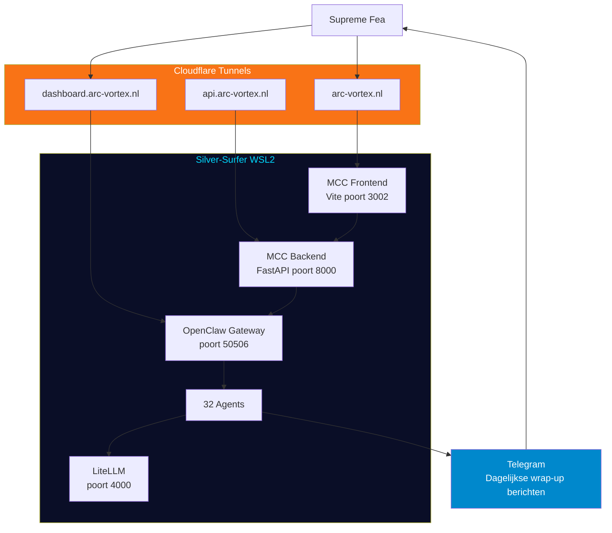

# CH11 — Mission Control

*Het cockpit van ARC AI AGENTS — hoe Supreme Fea het systeem monitort, aanstuurt en in de gaten houdt.*

---

## Het Cockpit

Supreme Fea leidt een systeem van 32 agents. Zonder inzicht in wat er gebeurt is leiderschap blind vliegen. Mission Control is het cockpit — de plek waar alle informatie samenkomt en alle aansturing plaatsvindt.

Mission Control bestaat uit twee componenten: de Mission Control Center (MCC) webinterface en de OpenClaw Control UI.

---

## Mission Control Center — MCC

De MCC draait op arc-vortex.nl — een Cloudflare-getunneld React/Vite dashboard dat real-time inzicht geeft in het systeem. Het is toegankelijk via browser op elk apparaat.

**Dashboard**
Het dashboard toont een systeemoverzicht: gateway-status, Telegram-verbinding, agent-status per domein, actieve cronjobs, open todo-items en model tier-verdeling. In één oogopslag weet Supreme Fea hoe het systeem ervoor staat.

**Agents Tab**
De Agents-tab toont alle 32 agents als visuele kaarten met 3D WebGL-rendering. Elk agent heeft een statusdot, een tier-badge (rood/oranje/groen voor A/B/C) en het huidige baseline-model. Filters op domein en status maken navigatie eenvoudig.

**OpenClaw Tab**
De OpenClaw-tab geeft diepgaand inzicht in de gateway. Sub-tabs voor overzicht, agents, cronjobs, memory, logs en Telegram. Alle 128 cronjobs zijn hier zichtbaar met status, schema en laatste run.

**Tasks Tab**
De Tasks-tab beheert todo-items. Aanmaken, bijwerken, prioriteren en afsluiten — alles via de interface. Items worden gesorteerd op prioriteit (1=hoog, 3=laag) en status.

**Overige Tabs**
Analytics voor metrics en grafieken, Scheduler voor geplande taken, Comms voor communicatie-overzicht, Projects voor projectbeheer, Canon voor CODEX-documentatie, Diagrams voor systeemdiagrammen en Audit voor MD-bestandscontroles.

---

## OpenClaw Control UI

De OpenClaw Control UI draait op dashboard.arc-vortex.nl en geeft direct toegang tot de OpenClaw gateway. Hier worden tunnels geconfigureerd, agent-registraties beheerd en gateway-logs bekeken.

De gateway draait op poort 50506 op Silver-Surfer. Alle agent-communicatie via OpenClaw loopt door deze poort.

---

## Telegram Integratie

Supreme Fea ontvangt dagelijkse statusberichten via Telegram — één per agent, elke ochtend na de 00:00 UTC wrap-up run. Elk bericht bevat:

De status van de wrap-up run (✅ of ❌), hoeveel items zijn geconsolideerd uit JOURNAL en TASKS, of MEMORY.md is bijgewerkt, en eventuele issues of warnings.

Zo begint elke dag met een volledig overzicht van de nacht — zonder dat Supreme Fea actief iets hoeft te doen.

---

## Systeembeheer

**Silver-Surfer** is de host-machine — een WSL2 Ubuntu-omgeving op Windows. De volgende services draaien permanent:

OpenClaw gateway op poort 50506. MCC backend (FastAPI) op poort 8000. MCC frontend (Vite) op poort 3002. LiteLLM model-proxy op poort 4000. HTTP download server op poort 8888.

Cloudflare tunnels zorgen voor publieke toegang: arc-vortex.nl voor de MCC frontend, dashboard.arc-vortex.nl voor OpenClaw en api.arc-vortex.nl voor de MCC backend API.

---

## Diagram: MCC Architectuur

Zie: `DIAGRAMS/D15_mcc_architectuur.mermaid`

---

*Volgende hoofdstuk: CH12 — De Toekomst*
