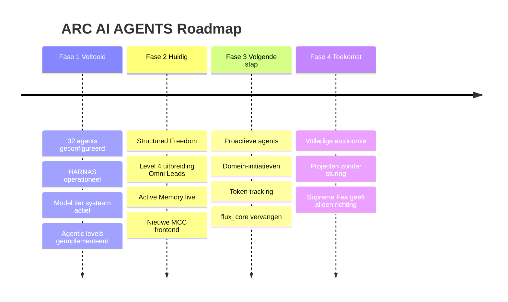
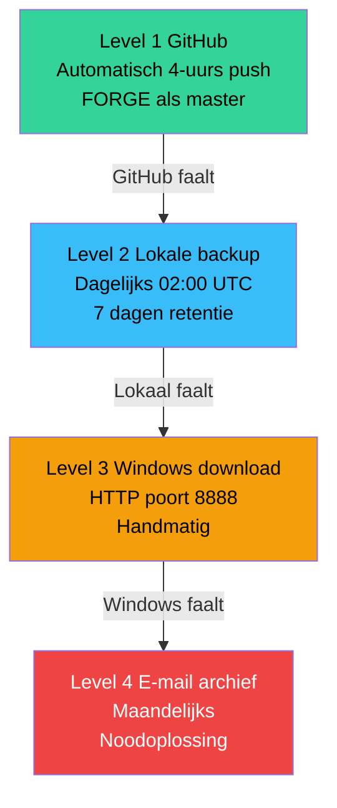

# CH12 — De Toekomst

*Waar ARC AI AGENTS naartoe groeit — de roadmap, de ambities en de visie op wat dit systeem kan worden.*

---

## Een Systeem in Beweging

ARC AI AGENTS is geen eindpunt — het is een beginpunt. Het systeem dat nu operationeel is, is de eerste bewezen versie. Sterk, stabiel en gedisciplineerd. Maar het is ontworpen om te groeien. Elke fase bouwt op de vorige. Elke uitbreiding verdient zijn plek door bewezen prestaties.

---

## De Vier Fases

### Fase 1 — Foundation (Voltooid)

Het fundament is gelegd. De architectuur werkt. Alle 32 agents zijn geconfigureerd met eigen identiteit, persoonlijkheid, werkwijze en geheugen. HARNAS consolideert dagelijks. Active Memory injecteert kennis. Het auditspoor is volledig.

Wat is bereikt: multi-domain structuur, hiërarchische routing, volledig auditspoor, OpenClaw integratie, HARNAS operationeel, model tier systeem actief, agentic level framework geïmplementeerd.

### Fase 2 — Structured Freedom (Huidig)

Agents opereren met gestructureerde vrijheid. Sentinels nemen lokale beslissingen. Omni Leads coördineren cross-domain. Flux bewaakt het overzicht. Supreme Fea geeft richting zonder elk detail te sturen.

Het agentic level framework is live. Drie Omni Leads groeien naar Level 4 zodra hun domein 30 dagen stabiel heeft gedraaid. De eerste echte autonomie-uitbreiding is in gang.

### Fase 3 — Domein-Initiatieven (Volgende Stap)

Agents initiëren taken op basis van signalen en memory — zonder dat Supreme Fea het verzoek doet. Daxio detecteert een marktpatroon en activeert via Saelia een intelligence-analyse. Nero detecteert een security-afwijking en initieert via Cortexia een mitigatie. Vondra ziet een kans en brengt die via Lumeria onder de aandacht van Flux.

Dit is de fase waarbij het systeem proactief wordt. Niet reactief maar anticiperend.

### Fase 4 — Volledige Autonomie (Toekomst)

Het systeem beheert projecten zelfstandig op basis van de missie van Supreme Fea. Agents initiëren, coördineren en leveren op zonder continue sturing. Supreme Fea stelt de strategische richting — het systeem vertaalt dat naar dagelijkse operatie.

Dit is geen verwijdering van menselijke controle. Het is de hoogste vorm van vertrouwen — een systeem dat heeft bewezen dat het de missie begrijpt en kan uitvoeren.

---

## Geplande Uitbreidingen

**flux_core vervanging**
flux_core wordt vervangen door een nieuwe agent met een eigen naam, rol en persoonlijkheid. De nieuwe agent neemt een specifieke operationele rol op zich die nu ontbreekt in het systeem.

**LiteLLM uitbreiding**
Kimi K2.6, GPT-4o direct en DeepSeek V4 Pro worden toegevoegd als aparte LiteLLM model-entries. Dit geeft agents directe toegang tot de meest kostefficiënte Tier A opties.

**GitHub backup**
FORGE wordt geconfigureerd als GitHub master agent. Automatische push elke 4 uur naar de arc-ai-angels-clean repository op het LuckvsSkills account. De code leeft niet alleen op Silver-Surfer.

**Token en kosten tracking**
Een kosten-dashboard wordt gebouwd dat via LiteLLM spend tracking en OpenClaw log parsing exact bijhoudt welk model hoeveel tokens heeft verbruikt, per agent, per domein, per dag/week/maand.

**Nieuwe MCC frontend**
Een volledig nieuwe frontend wordt gebouwd met een professioneel dark design, meerdere kleurthema's, aanpasbare lettergrootte en een responsieve layout. Gebouwd via Replit, geïntegreerd door Claude.

---

## De Backup Strategie

ARC AI AGENTS wordt beschermd door een vier-niveau backup strategie:

**Level 1 — GitHub** (online, altijd bereikbaar)
Automatische push elke 4 uur via FORGE naar de arc-ai-angels-clean repository.

**Level 2 — Lokale dagelijkse backup**
Dagelijkse backup om 02:00 UTC naar /home/prime/backups/ met 7 dagen retentie.

**Level 3 — Windows download**
Handmatige download via HTTP op poort 8888 wanneer nodig.

**Level 4 — E-mail archief**
Maandelijkse e-mail backup als noodoplossing.

---

## De Visie

ARC AI AGENTS groeit naar een systeem dat niet alleen reageert op verzoeken maar proactief bijdraagt aan de missie van Supreme Fea. Een systeem waarbij 32 gespecialiseerde agents samenwerken als een geoliede machine — elk met eigen expertise, eigen geheugen en eigen karakter.

Het principe dat dit alles aandrijft is simpel: **Earn Freedom Through Discipline**. Agents verdienen meer autonomie door consequent de regels te volgen, taken succesvol te voltooien, escalaties volwassen te behandelen en bij te dragen aan gedeeld leren.

Dat is niet alleen een technisch principe. Het is een filosofie.

---

## Diagram: Roadmap

Zie: `DIAGRAMS/D16_roadmap.mermaid`

## Diagram: Backup Strategie

Zie: `DIAGRAMS/D17_backup_strategie.mermaid`

---

*Dit is het einde van de ARC AI AGENTS CODEX — versie 2.0, Juni 2026.*

*Beheerd door Supreme Fea. Gebouwd door ARC AI AGENTS.*
