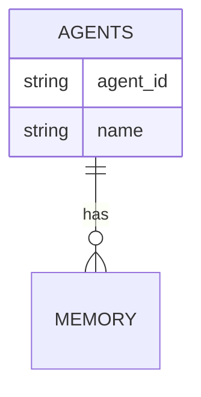

# B17 — Agent Management Schema

## Scope
Database schema voor agent registratie.

## Diagram

```mermaid
erDiagram
    AGENTS ||--o{ MEMORY : has
    AGENTS {
        string agent_id
        string name
    }
```
