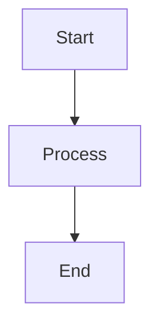

# Model Runtime & Providers
## Block 10 — Flux Orchestration Map

---

### Purpose

De Flux Orchestration Map visualiseert en beheert alle routing beslissingen binnen het ARC systeem. Het definieert welke taken naar welke teams gaan en hoe workflows worden samengesteld.

| Aspect | Functie |
|--------|---------|
| **Routing Rules** | Bepaal welk team welke taak krijgt |
| **Workflow Composition** | Stel complexe workflows samen |
| **Dependency Graph** | Beheer afhankelijkheden tussen taken |
| **State Tracking** | Volg voortgang van workflows |

### System Context

Flux Orchestration Map is het centrale brein van Flux. Het ontvangt intenties en vertaalt deze naar concrete routing beslissingen.

Intentie -> Router -> Orchestration Map -> Team Assignment -> Execution

### Core Structure

#### 1. Routing Engine
Bepaalt doel op basis van intentie type.

#### 2. Workflow Builder
Construeert multi-step workflows.

#### 3. State Manager
Houdt workflow staat bij.

#### 4. Dependency Resolver
Bepaalt uitvoeringsvolgorde.

### How It Works

1. Ontvang intentie van Nova
2. Analyseer type en vereisten
3. Zoek routing regels
4. Bepaal target team
5. Creer workflow indien nodig
6. Dispatch naar Sentinel

### How to Find / Use It

Orchestration rules zijn configureerbaar via admin interface.

### Why It Exists

Centrale routing logica maakt het systeem configureerbaar en onderhoudbaar.

## Routing Decision Flow

+----------------+
|  GIO Intent    |
+----------------+
        |
        v
+----------------+
|  Route Lookup  |
+----------------+
        |
   +----+----+
   |         |
   v         v
+------+  +------+
|Simple|  |Complex|
|Route |  |Route |
+------+  +------+
   |         |
   v         v
+------+  +------+
|Direct|  |Multi-|
|Send  |  |Step  |
+------+  +------+

---

## Diagram

\`\`\`mermaid
flowchart TB
    A --> B
\`\`\`

---

## Diagram

