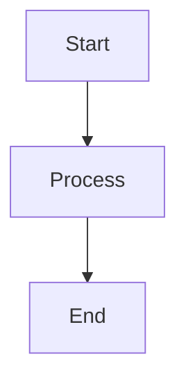

# Model Runtime & Providers
## Block 11 — Model Governance Matrix

---

### Purpose

De Model Governance Matrix definieert policies, restricties en compliance regels voor alle AI modellen in het systeem. Het zorgt voor verantwoord AI gebruik.

| Aspect | Functie |
|--------|---------|
| **Access Control** | Wie mag welk model gebruiken |
| **Usage Limits** | Rate limits en quota per model |
| **Compliance** | Regulatoire vereisten (GDPR, etc) |
| **Audit Trail** | Logging van alle model gebruik |

### System Context

Governance Matrix controleert alle model toegang. Het zit tussen Router en Model Inference.

Request -> Router -> Governance Check -> Model Inference

### Core Structure

#### 1. Policy Engine
Evalueert policies tegen requests.

#### 2. Access Controller
Autoriseert gebruikers en tenants.

#### 3. Audit Logger
Registreert alle model calls.

#### 4. Compliance Checker
Valideert tegen regulatoire regels.

### How It Works

1. Request komt binnen
2. Identificeer gebruiker en tenant
3. Check toegangsrechten
4. Valideer rate limits
5. Log de request
6. Allow of deny

### How to Find / Use It

Governance policies worden beheerd via governance dashboard.

### Why It Exists

Verantwoord AI gebruik vereist controle, auditability en compliance.

## Governance Check Flow

+----------------+      +----------------+      +----------------+
|  Model Request |----->|  Governance    |----->|  Policy Check  |
|  (User/API)    |      |  (M11)         |      |  (Allow?)      |
+----------------+      +----------------+      +----------------+
                               |
                    +----------+----------+
                    |                     |
                    v                     v
             +------------+        +------------+
             |  ALLOWED   |        |  DENIED    |
             |  -> Model  |        |  -> Audit  |
             +------------+        +------------+

---

## Diagram

\`\`\`mermaid
flowchart TB
    A --> B
\`\`\`

---

## Diagram

