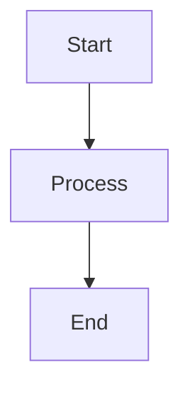

# Model Runtime & Providers
## Block 12 — Agent Build Blueprint

---

### Purpose

De Agent Build Blueprint definieert de standaard structuur en configuratie voor alle agents in het ARC ecosysteem. Het zorgt voor consistente agent creatie.

| Aspect | Functie |
|--------|---------|
| **Template Definition** | Standaard agent templates |
| **Configuration Schema** | Validatie van agent config |
| **Build Pipeline** | Automatische agent constructie |
| **Versioning** | Agent versie beheer |

### System Context

Build Blueprint wordt gebruikt door agent factory om nieuwe agents te creeren.

Config -> Blueprint -> Factory -> Agent Instance

### Core Structure

#### 1. Template Library
Vooraf gedefinieerde agent templates.

#### 2. Config Validator
Valideert agent configuraties.

#### 3. Build Orchestrator
Coordineert agent constructie.

#### 4. Registry Connector
Slaat blueprints op in registry.

### How It Works

1. Ontvang agent definitie
2. Selecteer template
3. Valideer configuratie
4. Build agent components
5. Registreer agent
6. Return agent instance

### How to Find / Use It

Blueprints zijn beschikbaar via agent builder interface.

### Why It Exists

Standaardisatie maakt agents onderhoudbaar en herbruikbaar.

## Agent Build Pipeline

+----------------+      +----------------+      +----------------+
|  Agent Config  |----->|  Blueprint     |----->|  Validation    |
|  (YAML/JSON)   |      |  (M12)         |      |  (Schema)      |
+----------------+      +----------------+      +----------------+
                               |
                               v
                        +----------------+
                        |  Build         |
                        |  Orchestrator  |
                        +----------------+
                               |
                               v
                        +----------------+
                        |  Agent         |
                        |  Instance      |
                        +----------------+

---

## Diagram

\`\`\`mermaid
flowchart TB
    A --> B
\`\`\`

---

## Diagram

