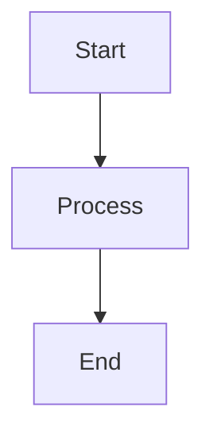

# Model Runtime & Providers
## Block 13 — Agent Communication & Memory Topology

---

### Purpose

Dit block definieert hoe agents met elkaar communiceren en hoe gedeelde memory is georganiseerd. Het zorgt voor efficiënte informatieuitwisseling tussen agents.

| Aspect | Functie |
|--------|---------|
| **Message Bus** | Asynchrone communicatie tussen agents |
| **Shared Memory** | Gedeelde data ruimte voor teams |
| **State Sync** | Real-time status updates |
| **Event Streaming** | Publish-subscribe voor events |

### System Context

Alle agents verbinden via het communicatie netwerk. Memory is gedeeld binnen teams.

Agent A <-> Message Bus <-> Agent B
Team Memory <-> Shared State <-> All Team Members

### Core Structure

#### 1. Message Queue
Asynchrone berichten tussen agents.

#### 2. Shared Memory Pool
Gedeelde data voor snelle toegang.

#### 3. Event Bus
Broadcast mechanisme voor updates.

#### 4. State Store
Centrale state management.

### How It Works

1. Agent publiceert event naar bus
2. Geinteresseerde agents ontvangen event
3. State updates worden gesynchroniseerd
4. Shared memory wordt geupdate
5. Alle agents zien consistente state

### How to Find / Use It

Communicatie is automatisch voor alle agents. Configuratie via agent manifest.

### Why It Exists

Gedeelde context en communicatie zijn essentieel voor teamwork tussen agents.

---

## Diagram

\`\`\`mermaid
flowchart TB
    A --> B
\`\`\`

---

## Diagram

