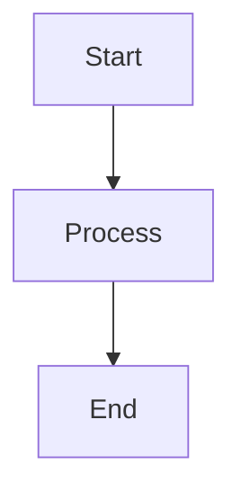

# Model Runtime & Providers
## Block 14 — Flux Sentinel Integration

---

### Purpose

Dit block definieert de integratie tussen Flux (orchestrator) en Sentinel (specialist teams). Het zorgt voor soepele overdracht van taken.

| Aspect | Functie |
|--------|---------|
| **Task Handoff** | Overdracht van Flux naar Sentinel |
| **Status Reporting** | Voortgang terug naar Flux |
| **Error Escalation** | Fouten escaleren naar Flux |
| **Result Aggregation** | Resultaten verzamelen bij Sentinel |

### System Context

Flux delegeert aan Sentinel. Sentinel rapporteert terug naar Flux.

Flux -> Task Queue -> Sentinel -> Execution -> Results -> Flux

### Core Structure

#### 1. Task Dispatcher
Stuurt taken naar juiste Sentinel team.

#### 2. Status Monitor
Volgt uitvoering voortgang.

#### 3. Result Collector
Verzamelt en valideert resultaten.

#### 4. Error Handler
Beheert fouten en retries.

### How It Works

1. Flux dispatcht taak
2. Sentinel ontvangt en assigned aan worker
3. Worker voert uit
4. Sentinel rapporteert voortgang
5. Bij completie: resultaten naar Flux

### How to Find / Use It

Integratie is intern en automatisch. Geen directe gebruiker interactie.

### Why It Exists

Scheiding van orchestratie (Flux) en executie (Sentinel) vereist soepele integratie.

---

## Diagram

\`\`\`mermaid
flowchart TB
    A --> B
\`\`\`

---

## Diagram

