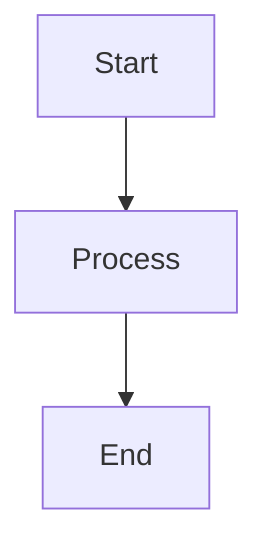

# Model Runtime & Providers
## Block 15 — Sentinel Protocol Enrichment

---

### Purpose

Dit block voegt metadata en context toe aan Sentinel protocols. Het verrijkt ruwe data met domein kennis en context.

| Aspect | Functie |
|--------|---------|
| **Context Injection** | Voeg relevante context toe |
| **Metadata Tagging** | Label data met domein tags |
| **Knowledge Retrieval** | Haal relevante kennis op |
| **Format Normalization** | Standaardiseer data formaten |

### System Context

Enrichment zit tussen binnenkomende data en Sentinel verwerking.

Raw Data -> Enrichment -> Enriched Data -> Sentinel Processing

### Core Structure

#### 1. Context Analyzer
Bepaalt welke context nodig is.

#### 2. Knowledge Fetcher
Haalt domein kennis op.

#### 3. Metadata Engine
Voegt tags en labels toe.

#### 4. Format Transformer
Normaliseert naar standaard formaat.

### How It Works

1. Ontvang ruwe data
2. Analyseer voor context behoeften
3. Fetch relevante kennis
4. Voeg metadata toe
5. Transformeer formaat
6. Doorgeven aan Sentinel

### How to Find / Use It

Enrichment rules zijn configureerbaar per domein.

### Why It Exists

Ruwe data heeft context nodig voor betekenisvolle verwerking door Sentinel.

---

## Diagram

\`\`\`mermaid
flowchart TB
    A --> B
\`\`\`

---

## Diagram

