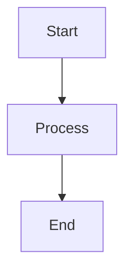

# Model Runtime & Providers
## Block 16 — Task Queue Structure

---

### Purpose

Dit block definieert de task queue architectuur voor het ARC systeem. Het beheert de volgorde en prioriteit van taken die door agents moeten worden uitgevoerd.

| Aspect | Functie |
|--------|---------|
| **Priority Management** | Bepaal welke taken eerst |
| **Load Balancing** | Verdeel taken over workers |
| **Retry Logic** | Opnieuw proberen bij failures |
| **Dead Letter Queue** | Foute taken apart houden |

### System Context

Task Queue zit tussen Flux en Sentinel. Het buffert taken en regelt uitvoering.

Flux -> Queue -> Router -> Worker Pool -> Execution

### Core Structure

#### 1. Priority Queue
Hoog naar laag prioriteit sortering.

#### 2. Delay Queue
Taken voor later uitvoering.

#### 3. Retry Queue
Failed taken voor opnieuw proberen.

#### 4. Dead Letter Queue
Permanent failed taken.

### How It Works

1. Taak komt binnen van Flux
2. Prioriteit wordt bepaald
3. Taak wordt in juiste queue geplaatst
4. Worker pakt taak op
5. Bij success: taak compleet
6. Bij failure: retry of dead letter

### How to Find / Use It

Queue status is zichtbaar in monitoring dashboard.

### Why It Exists

Queues decoupen productie van consumptie en zorgen voor resilience.

---

## Diagram

\`\`\`mermaid
flowchart TB
    A --> B
\`\`\`

---

## Diagram

