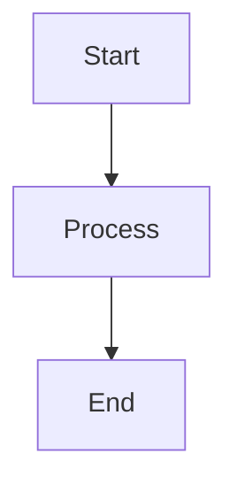

# Model Runtime & Providers
## Block 17 — Flux Routing Blueprint

---

### Purpose

Dit block definieert de complete routing architectuur binnen Flux. Het beschrijft hoe alle componenten samenwerken om taken te routeren.

| Aspect | Functie |
|--------|---------|
| **Route Definition** | Definieer alle routes |
| **Handler Mapping** | Koppel routes aan handlers |
| **Middleware Chain** | Verwerkingsketen per route |
| **Fallback Logic** | Wat bij onbekende routes |

### System Context

Routing Blueprint is de kern van Flux. Alle verkeer loopt hierdoor.

Request -> Router -> Blueprint Lookup -> Handler -> Response

### Core Structure

#### 1. Route Table
Alle gedefinieerde routes.

#### 2. Handler Registry
Geregistreerde handlers per route.

#### 3. Middleware Stack
Pre en post processing.

#### 4. Error Router
Routing bij fouten.

### How It Works

1. Request arriveert
2. URL/pattern matching
3. Middleware uitvoering
4. Handler aanroep
5. Response terug

### How to Find / Use It

Routes zijn configureerbaar via routing configuratie bestanden.

### Why It Exists

Centrale routing architectuur maakt het systeem overzichtelijk en onderhoudbaar.

---

## Diagram

\`\`\`mermaid
flowchart TB
    A --> B
\`\`\`

---

## Diagram

