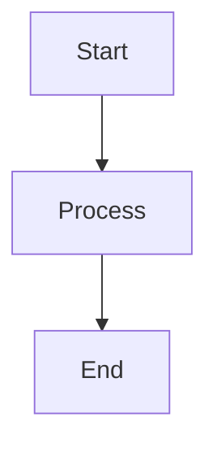

# Platform & Runtime
## Block 01 — OpenClaw Core Installatie

---

### Purpose

Dit block beschrijft de installatie en configuratie van de OpenClaw core - de fundamentele runtime omgeving voor het ARC AI Agents platform. OpenClaw vormt de basislaag waarop alle agents en services draaien.

| Aspect | Functie |
|--------|---------|
| **Base OS Setup** | Linux distributie configuratie |
| **Dependency Install** | Vereiste packages en libraries |
| **Network Config** | Firewall, DNS, networking |
| **Storage Setup** | Disk partitioning, mounts |

### System Context

OpenClaw Core is de onderste laag van de stack. Alles bouwt hierop voort.

Hardware -> OS -> OpenClaw Core -> Runtime Services -> Agents

### Core Structure

#### 1. OS Layer
Ubuntu LTS of RHEL met security patches.

#### 2. Package Manager
APT/YUM met custom repositories.

#### 3. Initial Config
Basis systeem configuratie.

#### 4. Bootstrap Scripts
Automatische installatie scripts.

### How It Works

1. Bare metal of VM provisioning
2. OS installatie met kickstart/cloud-init
3. Package installatie via script
4. Netwerk configuratie
5. Storage setup en mounting
6. Basis security hardening

### How to Find / Use It

Installatie via: ./scripts/install_openclaw.sh

### Why It Exists

Een gestandaardiseerde basis is essentieel voor consistente deployments.

---

## Diagram

\`\`\`mermaid
flowchart TB
    A[Start] --> B[Process]
    B --> C[End]
\`\`\`

---

## Diagram

