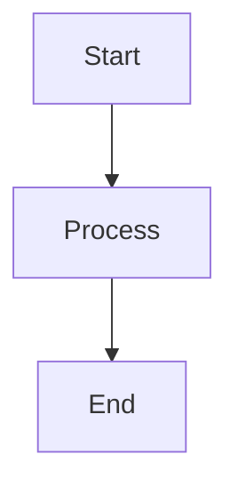

# Platform & Runtime
## Block 02 — Systemd Runtime Services

---

### Purpose

Dit block definieert alle systemd services die de OpenClaw runtime beheren. Systemd zorgt voor service management, automatisch starten, en monitoring.

| Aspect | Functie |
|--------|---------|
| **Service Management** | Start, stop, restart services |
| **Auto-start** | Boot-time service initialisatie |
| **Logging** | Journald integratie |
| **Resource Control** | Cgroups voor resource limits |

### System Context

Systemd beheert alle OpenClaw services bovenop de core installatie.

OpenClaw Core -> Systemd -> Services -> Agents

### Core Structure

#### 1. Main Service
openclaw.service - hoofd daemon.

#### 2. Agent Services
Per-agent service instanties.

#### 3. Support Services
Database, cache, message queue.

#### 4. Timer Units
Geplande taken en cleanup.

### How It Works

1. Systemd start bij boot
2. Laadt openclaw.service
3. Start afhankelijkheden
4. Start agent services
5. Monitored health
6. Restart bij failures

### How to Find / Use It

Beheer via: systemctl status openclaw

### Why It Exists

Systemd is de standaard voor Linux service management.

---

## Diagram

\`\`\`mermaid
flowchart TB
    A[Start] --> B[Process]
    B --> C[End]
\`\`\`

---

## Diagram

