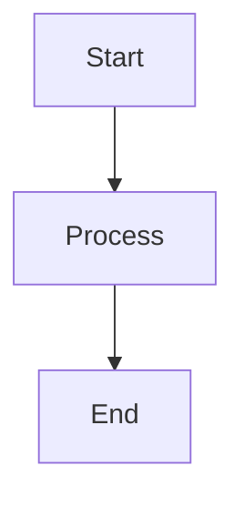

# Platform & Runtime
## Block 03 — Hardened Agent Runner

---

### Purpose

Dit block beschrijft de beveiligde omgeving waarin agents draaien. De hardened runner isoleert agents en beperkt hun capabilities.

| Aspect | Functie |
|--------|---------|
| **Sandboxing** | Isolatie van agent processen |
| **Capability Dropping** | Verwijder onnodige rechten |
| **Seccomp** | Filter systeem calls |
| **AppArmor** | Mandatory access control |

### System Context

De runner zit tussen systemd en de agents. Het is de beveiligingslaag.

Systemd -> Hardened Runner -> Sandboxed Agent

### Core Structure

#### 1. Sandbox Manager
Creëert en beheert sandboxes.

#### 2. Security Profiles
Per-agent security policies.

#### 3. Monitor
Controleert agent gedrag.

#### 4. Kill Switch
Noodstop voor misdragende agents.

### How It Works

1. Ontvang agent start request
2. Creëer nieuwe sandbox
3. Drop capabilities
4. Start agent in sandbox
5. Monitor gedrag
6. Cleanup bij stop

### How to Find / Use It

Configuratie in: /etc/openclaw/security/profiles/

### Why It Exists

Agents zijn potentieel gevaarlijk; isolatie beschermt het systeem.

---

## Diagram

\`\`\`mermaid
flowchart TB
    A[Start] --> B[Process]
    B --> C[End]
\`\`\`

---

## Diagram

