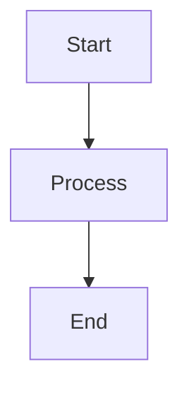

# Platform & Runtime
## Block 04 — Central Env + Allowlists

---

### Purpose

Dit block beheert centrale omgevingsvariabelen en toegestane lijsten. Het zorgt voor consistente configuratie en security hardening via allowlisting.

| Aspect | Functie |
|--------|---------|
| **Env Management** | Centrale configuratie variabelen |
| **Allowlists** | Toegestane waarden en acties |
| **Secrets** | Veilige opslag van credentials |
| **Validation** | Controleer configuratie waarden |

### System Context

Centrale config wordt gedeeld door alle services en agents.

Config Store -> Services -> Agents

### Core Structure

#### 1. Config Store
Centrale opslag voor alle configuratie.

#### 2. Allowlist Engine
Valideert toegestane waarden.

#### 3. Secret Vault
Veilige opslag voor gevoelige data.

#### 4. Validator
Controleert configuratie correctheid.

### How It Works

1. Laad centrale configuratie
2. Valideer tegen allowlists
3. Decrypt secrets indien nodig
4. Distribueer naar services
5. Monitor voor wijzigingen
6. Update dynamisch

### How to Find / Use It

Config in: /etc/openclaw/config/ en Vault

### Why It Exists

Centrale configuratie voorkomt inconsistentie en vergemakkelijkt beheer.

---

## Diagram

\`\`\`mermaid
flowchart TB
    A[Start] --> B[Process]
    B --> C[End]
\`\`\`

---

## Diagram

