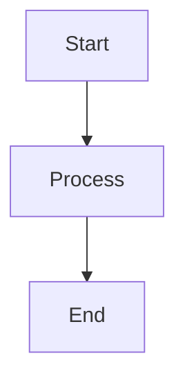

# Platform & Runtime
## Block 05 — Linux User Isolation

---

### Purpose

Dit block implementeert gebruikersisolatie op Linux niveau. Elke agent en service draait onder eigen gebruiker met minimale rechten.

| Aspect | Functie |
|--------|---------|
| **User Creation** | Aanmaken van systeem gebruikers |
| **Group Management** | Organiseer gebruikers in groepen |
| **Permission Sets** | Fijnmazige toegangsrechten |
| **Chroot Jails** | Filesystem isolatie |

### System Context

User isolatie werkt samen met de hardened runner voor defense in depth.

Root -> System Users -> Agent Users -> Chroot

### Core Structure

#### 1. User Manager
Creëert en beheert systeem gebruikers.

#### 2. Group Policy
Definieert groepen en rechten.

#### 3. Filesystem Isolator
Chroot en mount namespaces.

#### 4. Permission Enforcer
Dwingt toegangsrechten af.

### How It Works

1. Creëer dedicated gebruiker per agent
2. Wijs groepen en rechten toe
3. Setup chroot omgeving
4. Start agent als gebruiker
5. Enforce filesystem restricties

### How to Find / Use It

Gebruikers in: /etc/passwd (prefix: oc_)

### Why It Exists

User isolatie is fundamentele Linux security.

---

## Diagram

\`\`\`mermaid
flowchart TB
    A[Start] --> B[Process]
    B --> C[End]
\`\`\`

---

## Diagram

