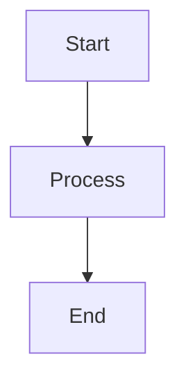

# Platform & Runtime
## Block 06 — Worker Skeleton Cluster

---

### Purpose

Dit block beschrijft de worker cluster architectuur. Het definieert hoe meerdere worker nodes samenwerken als een cluster voor schaalbaarheid en hoge beschikbaarheid.

| Aspect | Functie |
|--------|---------|
| **Node Management** | Toevoegen/verwijderen van workers |
| **Load Distribution** | Verdeel werk over cluster |
| **Failover** | Bij uitval van een node |
| **Cluster State** | Gedeelde state tussen nodes |

### System Context

De worker cluster vormt de executie laag van het platform.

Control Plane -> Worker Cluster -> Agent Execution

### Core Structure

#### 1. Master Node
Coordinatie en scheduling.

#### 2. Worker Nodes
Executie van agents.

#### 3. Cluster Store
Gedeelde state en metadata.

#### 4. Network Mesh
Inter-node communicatie.

### How It Works

1. Master ontvangt taak
2. Bepaal beschikbare worker
3. Dispatch taak naar worker
4. Worker voert uit
5. Rapporteer resultaat
6. Bij node failure: reschedule

### How to Find / Use It

Cluster beheer via: oc-admin cluster status

### Why It Exists

Clusters bieden schaalbaarheid en fault tolerance.

---

## Diagram

\`\`\`mermaid
flowchart TB
    A[Start] --> B[Process]
    B --> C[End]
\`\`\`

---

## Diagram

