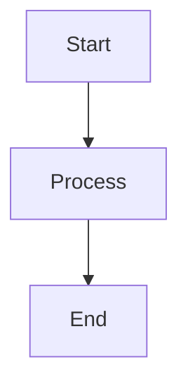

# Security Hardening
## Block 07 — Baseline Inventory

---

### Purpose

Dit block inventariseert alle systemen, services en configuraties om een security baseline vast te stellen. Het is de fundering voor alle verdere hardening activiteiten.

| Aspect | Functie |
|--------|---------|
| **Asset Discovery** | Identificeer alle systemen |
| **Service Mapping** | Inventariseer draaiende services |
| **Config Audit** | Documenteer huidige configuraties |
| **Vulnerability Scan** | Initiële kwetsbaarheidsanalyse |

### System Context

Baseline Inventory is de eerste stap in het security hardening proces.

Discovery -> Inventory -> Analysis -> Hardening Plan

### Core Structure

#### 1. Asset Scanner
Automatische discovery van systemen.

#### 2. Service Detector
Identificeert draaiende services.

#### 3. Config Collector
Verzamelt configuratie bestanden.

#### 4. Report Generator
Creeert baseline rapporten.

### How It Works

1. Scan netwerk voor assets
2. Inventariseer alle systemen
3. Documenteer services
4. Verzamel configuraties
5. Analyseer kwetsbaarheden
6. Genereer baseline rapport

### How to Find / Use It

Baseline tool: ./scripts/baseline_scan.sh

### Why It Exists

Je kunt niet beschermen wat je niet kent. Inventory is essentieel.

---

## Diagram

\`\`\`mermaid
flowchart TB
    A[Start] --> B[Process]
    B --> C[End]
\`\`\`

---

## Diagram

