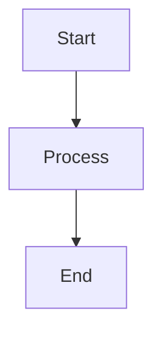

# Security Hardening
## Block 08 — Monitoring / Runtime Safety

---

### Purpose

Dit block implementeert continue monitoring en runtime safety controles. Het detecteert anomalies en potentiële security incidents in real-time.

| Aspect | Functie |
|--------|---------|
| **Behavior Monitoring** | Detecteer afwijkend gedrag |
| **Resource Monitoring** | Track CPU, memory, netwerk |
| **Anomaly Detection** | Identificeer verdachte patronen |
| **Alerting** | Waarschuw bij incidents |

### System Context

Monitoring draait overal waar agents actief zijn.

Agents -> Monitors -> Analyzer -> Alerts -> Response

### Core Structure

#### 1. Behavior Analyzer
Analyseert agent gedrag.

#### 2. Resource Tracker
Monitors systeem resources.

#### 3. Anomaly Engine
Detecteert afwijkingen.

#### 4. Alert Manager
Beheert notificaties.

### How It Works

1. Verzamel metrics
2. Analyseer gedrag
3. Detecteer anomalies
4. Genereer alerts
5. Trigger response

### How to Find / Use It

Dashboard: /monitoring/security

### Why It Exists

Real-time detectie is essentieel voor snelle respons op threats.

---

## Diagram

\`\`\`mermaid
flowchart TB
    A[Start] --> B[Process]
    B --> C[End]
\`\`\`

---

## Diagram

