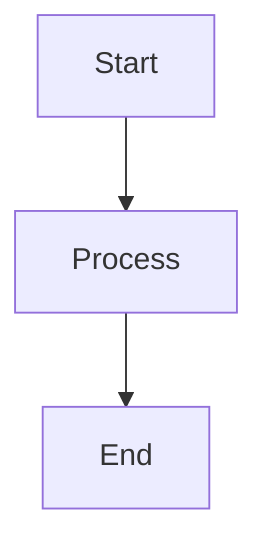

# Security Hardening
## Block 09 — Incident Response / Kill Switch

---

### Purpose

Dit block definieert incident response procedures en de kill switch functionaliteit. Het stopt automatisch of handmatig verdachte agents bij security incidents.

| Aspect | Functie |
|--------|---------|
| **Auto Kill** | Automatische stop bij anomalies |
| **Manual Kill** | Handmatige noodstop |
| **Incident Playbook** | Standaard response procedures |
| **Forensics** | Logging voor onderzoek |

### System Context

Kill switch kan elk agent proces stoppen.

Alert -> Decision -> Kill Switch -> Termination -> Forensics

### Core Structure

#### 1. Kill Engine
Voert terminatie uit.

#### 2. Decision Module
Bepaalt of kill nodig is.

#### 3. Playbook Manager
Beheert response procedures.

#### 4. Forensics Logger
Logt alles voor analyse.

### How It Works

1. Detecteer threat
2. Evalueer ernst
3. Beslis actie
4. Voer kill uit
5. Log forensics

### How to Find / Use It

Kill switch: oc-admin kill --agent-id <id>

### Why It Exists

Noodstop is essentieel voor containment van security incidents.

---

## Diagram

\`\`\`mermaid
flowchart TB
    A[Start] --> B[Process]
    B --> C[End]
\`\`\`

---

## Diagram

