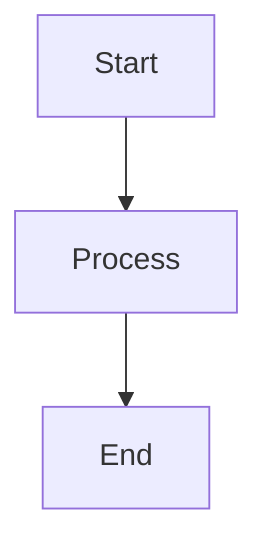

# Security Hardening
## Block 10 — Secrets Hardening

---

### Purpose

Dit block beheert de veilige opslag en het gebruik van secrets (wachtwoorden, API keys, tokens). Het voorkomt leakage en ongeautoriseerde toegang.

| Aspect | Functie |
|--------|---------|
| **Vault Storage** | Versleutelde opslag van secrets |
| **Access Control** | Wie mag welke secrets zien |
| **Rotation** | Automatisch vernieuwen van secrets |
| **Audit** | Log alle secret toegang |

### System Context

Secrets zijn gescheiden van code en configuratie.

Vault -> Access Control -> Agents -> Automatic Rotation

### Core Structure

#### 1. Secret Vault
Veilige opslag met encryptie.

#### 2. Access Manager
Controleert toegangsrechten.

#### 3. Rotation Engine

Vernieuwt secrets automatisch.

#### 4. Audit Logger
Logt alle toegang.

### How It Works

1. Secret wordt opgeslagen in vault
2. Access policy bepaalt wie mag lezen
3. Agent vraagt secret aan
4. Audit log wordt geschreven
5. Secret wordt verstrekt
6. Rotatie volgens schedule

### How to Find / Use It

Vault CLI: oc-vault put/get/delete

### Why It Exists

Secrets in code zijn een groot security risico.

---

## Diagram

\`\`\`mermaid
flowchart TB
    A[Start] --> B[Process]
    B --> C[End]
\`\`\`

---

## Diagram

