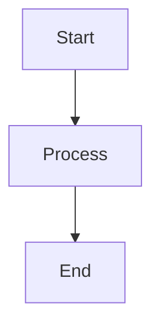

# Security Hardening
## Block 11 — Internet / Egress Policy

---

### Purpose

Dit block controleert uitgaande netwerkverbindingen van agents. Het voorkomt data exfiltratie en beperkt communicatie naar externe systemen.

| Aspect | Functie |
|--------|---------|
| **Egress Filtering** | Blokkeer ongeautoriseerde uitgaande verbindingen |
| **Allowlist** | Toegestane externe endpoints |
| **Rate Limiting** | Beperk data volume |
| **DNS Control** | Controleer domein resolutie |

### System Context

Egress policy zit tussen agents en het internet.

Agents -> Egress Filter -> Firewall -> Internet

### Core Structure

#### 1. Egress Gateway
Centrale uitgaande poort.

#### 2. Policy Engine
Evalueert verbindingen.

#### 3. Rate Limiter
Beperkt data volume.

#### 4. DNS Filter
Controleert domeinen.

### How It Works

1. Agent wil externe verbinding
2. Egress filter evalueert policy
3. Check allowlist
4. Check rate limits
5. Allow of deny verbinding

### How to Find / Use It

Policy config: /etc/openclaw/egress/policy.yaml

### Why It Exists

Data exfiltratie voorkomen is essentieel voor security.

---

## Diagram

\`\`\`mermaid
flowchart TB
    A[Start] --> B[Process]
    B --> C[End]
\`\`\`

---

## Diagram

