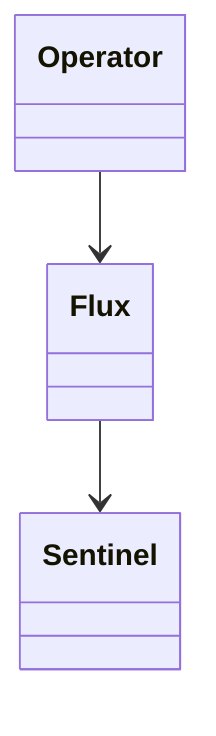

# M11 — Model Governance Matrix

## Scope
Dit document definieert de model governance matrix voor ARC / OpenClaw.

Doel:
- per agenttype vastleggen welk model gebruikt wordt
- fallbacklogica expliciet maken
- cost/performance-afweging structureren
- Mission Control override-richting voorbereiden

## 1. Governance uitgangspunt

Modelkeuze volgt:
- rol
- risico
- kosten
- performance
- domeinvereisten

Niet alleen:
- beschikbaarheid
- toeval
- ad hoc keuze

## 2. Huidige actieve providers

Actief:
- Google / Gemini
- Moonshot / Kimi

Nog niet actief in providerlaag:
- Ollama
- OpenAI

## 3. Matrix per agenttype

### Direct Interface Agents
Voorbeelden:
- Nova
- James
- Jim

Beleid:
- quality-first
- stabiele output
- user-facing veiligheid hoog
- voorkeur voor sterk cloudmodel

Richting:
- primary: Gemini
- fallback: Kimi

### Flux
Beleid:
- orchestration-first
- reasoning + routing + integratie
- mag sterker model gebruiken waar nodig

Richting:
- primary: Kimi
- fallback: Gemini

### Sentinel Lead AI Agents
Voorbeelden:
- Nero
- Sora
- Forge
- Clio

Beleid:
- domeinspecifieke kwaliteit
- parent governance
- modelkeuze afhankelijk van domein

Richting eerste wave:
- Nero: Gemini/Kimi
- Sora: Gemini/Kimi
- Forge: Kimi
- Clio: Gemini

### Workers
Beleid:
- cost-sensitive
- smalle subtaak
- parent-bound
- goedkoopst bruikbare route

Richting:
- toekomstig primary: Ollama/local waar geschikt
- huidige fallback: Gemini of Kimi afhankelijk van taak

## 4. Domeinrichting eerste wave

### Sentinel Security / Nero
- voorkeur: hoge betrouwbaarheid
- modelrichting: Gemini primary, Kimi fallback

### Sentinel Research / Sora
- voorkeur: research + verificatie
- modelrichting: Gemini of Kimi, afhankelijk van taakzwaarte

### Sentinel Engineering / Forge
- voorkeur: technische uitvoering
- modelrichting: Kimi primary, Gemini fallback

### Sentinel Documentation / Clio
- voorkeur: structurering en kwaliteit
- modelrichting: Gemini primary, Kimi fallback

## 5. Worker governance

Workers:
- erven governance van parent lead agent
- mogen niet willekeurig premium escalation doen
- krijgen beperkte modelruimte
- moeten later overridebaar zijn per workerclass

## 6. Mission Control richting

Mission Control moet later kunnen tonen:
- primary model per agent
- fallback model per agent
- providerstatus
- override status
- cost-sensitive routingstatus

Mission Control moet later kunnen aanpassen:
- primary model
- fallback model
- local/cloud voorkeur
- worker enable/disable
- sentinel enable/disable

## 7. Ontwerpregels

Regel 1
User-facing agents krijgen kwaliteit voorrang.

Regel 2
Flux krijgt orchestration/reasoning voorrang.

Regel 3
Lead agents volgen domeinlogica.

Regel 4
Workers volgen cost-first logica.

Regel 5
Fallbacks moeten expliciet zijn.

Regel 6
Modelkeuze moet later overridebaar zijn via Mission Control.

## 8. Output van M11

M11 levert:
- model governance matrix
- eerste modelverdeling per agenttype
- fallbackrichting
- basis voor Mission Control modelbeheer

---

## Governance Diagram

